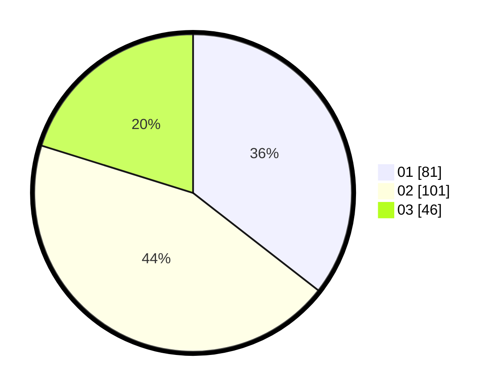

# Hasil

Hasil perolehan suara paslon dapat dilihat pada file paslon-01.txt, paslon-02.txt, dan paslon-03.txt.

Jika tidak ada, artinya data tersebut belum ada pada SIREKAP.

## Perolehan Suara

 * Paslon 01: **81**.
 * Paslon 02: **101**.
 * Paslon 03: **46**.

## Foto C Plano

https://sirekap-obj-formc.kpu.go.id/6db1/pemilu/ppwp/31/74/05/10/03/3174051003138-20240216-210648--3f4b6283-f9e6-4b11-ab70-3be4cd4f6d8b.jpg

https://sirekap-obj-formc.kpu.go.id/6db1/pemilu/ppwp/31/74/05/10/03/3174051003138-20240216-210649--7461b3ef-72f5-48b4-94fd-8e4b63553541.jpg

https://sirekap-obj-formc.kpu.go.id/6db1/pemilu/ppwp/31/74/05/10/03/3174051003138-20240216-210648--1cd97e03-b826-482f-b629-a3ece047e3e0.jpg

## DATA PEMILIH TETAP

Jumlah pemilih dalam DPT: **280**.
 * L: **138**.
 * P: **142**.

## DATA PENGGUNA HAK PILIH

Jumlah pengguna hak pilih dalam DPT: **228**.
 * L: **106**.
 * P: **122**.

Jumlah pengguna hak pilih dalam DPTb: **0**.
 * L: **0**.
 * P: **0**.

Jumlah pengguna hak pilih dalam DPK: **2**.
 * L: **1**.
 * P: **1**.

Jumlah pengguna hak pilih: **230**.
 * L: **107**.
 * P: **123**.

## JUMLAH SUARA SAH DAN TIDAK SAH

JUMLAH SELURUH SUARA SAH: **228**.

JUMLAH SUARA TIDAK SAH: **2**.

JUMLAH SELURUH SUARA SAH DAN SUARA TIDAK SAH: **230**.
