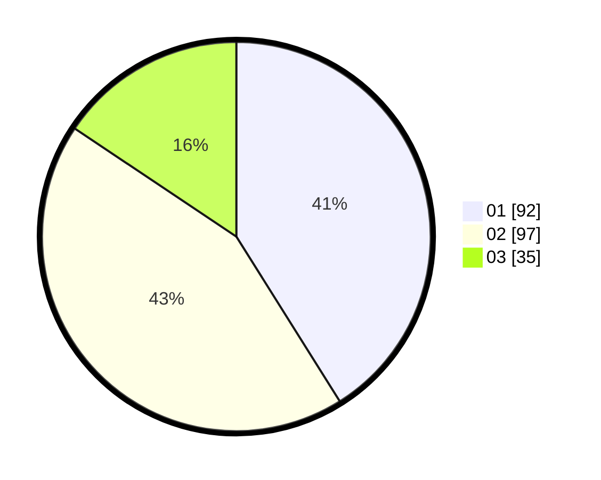

# Hasil

Hasil perolehan suara paslon dapat dilihat pada file paslon-01.txt, paslon-02.txt, dan paslon-03.txt.

Jika tidak ada, artinya data tersebut belum ada pada SIREKAP.

## Perolehan Suara

 * Paslon 01: **92**.
 * Paslon 02: **97**.
 * Paslon 03: **35**.

## Foto C Plano

https://sirekap-obj-formc.kpu.go.id/3a0c/pemilu/ppwp/31/74/05/10/04/3174051004001-20240216-155015--96a239bd-6b8e-4a5f-976b-75d34cf40146.jpg

https://sirekap-obj-formc.kpu.go.id/3a0c/pemilu/ppwp/31/74/05/10/04/3174051004001-20240216-155017--cbbecfe3-07d4-46a0-a773-815b214ebe98.jpg

https://sirekap-obj-formc.kpu.go.id/3a0c/pemilu/ppwp/31/74/05/10/04/3174051004001-20240216-155016--c3af0039-125f-45cd-90cc-7ddde57ed1d3.jpg

## DATA PEMILIH TETAP

Jumlah pemilih dalam DPT: **0**.
 * L: **0**.
 * P: **0**.

## DATA PENGGUNA HAK PILIH

Jumlah pengguna hak pilih dalam DPT: **0**.
 * L: **0**.
 * P: **0**.

Jumlah pengguna hak pilih dalam DPTb: **0**.
 * L: **0**.
 * P: **0**.

Jumlah pengguna hak pilih dalam DPK: **0**.
 * L: **0**.
 * P: **0**.

Jumlah pengguna hak pilih: **0**.
 * L: **0**.
 * P: **0**.

## JUMLAH SUARA SAH DAN TIDAK SAH

JUMLAH SELURUH SUARA SAH: **224**.

JUMLAH SUARA TIDAK SAH: **3**.

JUMLAH SELURUH SUARA SAH DAN SUARA TIDAK SAH: **227**.
