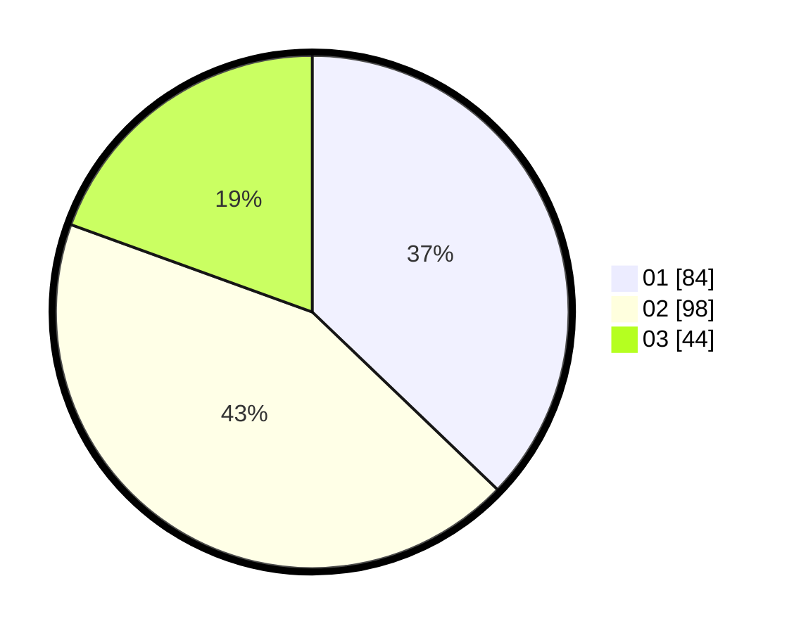

# Hasil

Hasil perolehan suara paslon dapat dilihat pada file paslon-01.txt, paslon-02.txt, dan paslon-03.txt.

Jika tidak ada, artinya data tersebut belum ada pada SIREKAP.

## Perolehan Suara

 * Paslon 01: **84**.
 * Paslon 02: **98**.
 * Paslon 03: **44**.

## Foto C Plano

https://sirekap-obj-formc.kpu.go.id/9152/pemilu/ppwp/31/74/05/10/04/3174051004002-20240214-155031--b1e37557-e183-489d-8bd8-57547c4a51ab.jpg

https://sirekap-obj-formc.kpu.go.id/9152/pemilu/ppwp/31/74/05/10/04/3174051004002-20240214-155130--640e6489-a401-40f8-a98d-544cb935e01c.jpg

https://sirekap-obj-formc.kpu.go.id/9152/pemilu/ppwp/31/74/05/10/04/3174051004002-20240214-155211--2b0e4900-c2c6-48d5-905d-5287bcefb127.jpg

## DATA PEMILIH TETAP

Jumlah pemilih dalam DPT: **229**.
 * L: **115**.
 * P: **114**.

## DATA PENGGUNA HAK PILIH

Jumlah pengguna hak pilih dalam DPT: **223**.
 * L: **111**.
 * P: **112**.

Jumlah pengguna hak pilih dalam DPTb: **4**.
 * L: **2**.
 * P: **2**.

Jumlah pengguna hak pilih dalam DPK: **2**.
 * L: **2**.
 * P: **0**.

Jumlah pengguna hak pilih: **229**.
 * L: **115**.
 * P: **114**.

## JUMLAH SUARA SAH DAN TIDAK SAH

JUMLAH SELURUH SUARA SAH: **226**.

JUMLAH SUARA TIDAK SAH: **3**.

JUMLAH SELURUH SUARA SAH DAN SUARA TIDAK SAH: **229**.
