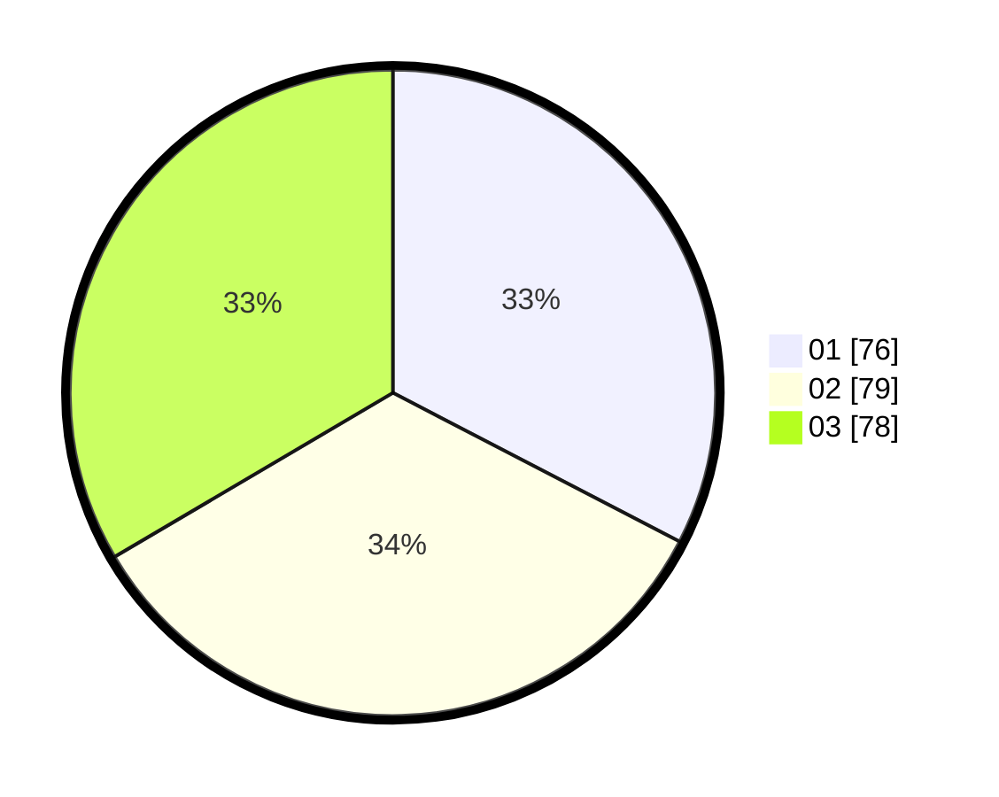

# Hasil

Hasil perolehan suara paslon dapat dilihat pada file paslon-01.txt, paslon-02.txt, dan paslon-03.txt.

Jika tidak ada, artinya data tersebut belum ada pada SIREKAP.

## Perolehan Suara

 * Paslon 01: **76**.
 * Paslon 02: **79**.
 * Paslon 03: **78**.

## Foto C Plano

https://sirekap-obj-formc.kpu.go.id/1205/pemilu/ppwp/31/74/05/10/04/3174051004003-20240216-013229--9a0ee635-253d-42d3-bb11-b1eaf9e674e9.jpg

https://sirekap-obj-formc.kpu.go.id/1205/pemilu/ppwp/31/74/05/10/04/3174051004003-20240216-012943--fd72ae24-b591-43f0-873e-6eeea10cdf75.jpg

https://sirekap-obj-formc.kpu.go.id/1205/pemilu/ppwp/31/74/05/10/04/3174051004003-20240216-013238--cc89f353-82da-43d4-9dca-3703ae4cd5da.jpg

## DATA PEMILIH TETAP

Jumlah pemilih dalam DPT: **291**.
 * L: **139**.
 * P: **152**.

## DATA PENGGUNA HAK PILIH

Jumlah pengguna hak pilih dalam DPT: **220**.
 * L: **102**.
 * P: **118**.

Jumlah pengguna hak pilih dalam DPTb: **16**.
 * L: **7**.
 * P: **9**.

Jumlah pengguna hak pilih dalam DPK: **0**.
 * L: **2**.
 * P: **0**.

Jumlah pengguna hak pilih: **238**.
 * L: **111**.
 * P: **127**.

## JUMLAH SUARA SAH DAN TIDAK SAH

JUMLAH SELURUH SUARA SAH: **233**.

JUMLAH SUARA TIDAK SAH: **5**.

JUMLAH SELURUH SUARA SAH DAN SUARA TIDAK SAH: **238**.
