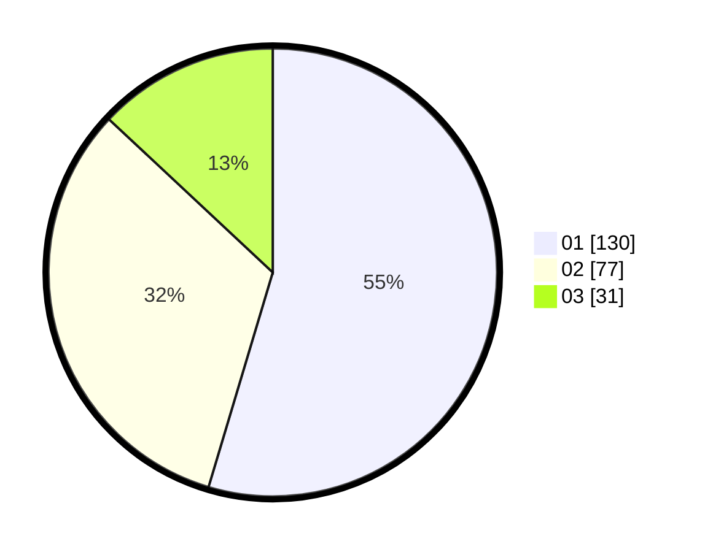

# Hasil

Hasil perolehan suara paslon dapat dilihat pada file paslon-01.txt, paslon-02.txt, dan paslon-03.txt.

Jika tidak ada, artinya data tersebut belum ada pada SIREKAP.

## Perolehan Suara

 * Paslon 01: **130**.
 * Paslon 02: **77**.
 * Paslon 03: **31**.

## Foto C Plano

https://sirekap-obj-formc.kpu.go.id/69c3/pemilu/ppwp/31/74/05/10/04/3174051004004-20240215-112335--32a21f71-256e-47b5-a509-e94c57c6686c.jpg

https://sirekap-obj-formc.kpu.go.id/69c3/pemilu/ppwp/31/74/05/10/04/3174051004004-20240215-112404--0670444a-2b3f-4d6c-ac5f-17e42e9fa345.jpg

https://sirekap-obj-formc.kpu.go.id/69c3/pemilu/ppwp/31/74/05/10/04/3174051004004-20240214-155113--e79eaa5c-514c-405c-90b6-cc460cc5ad9a.jpg
