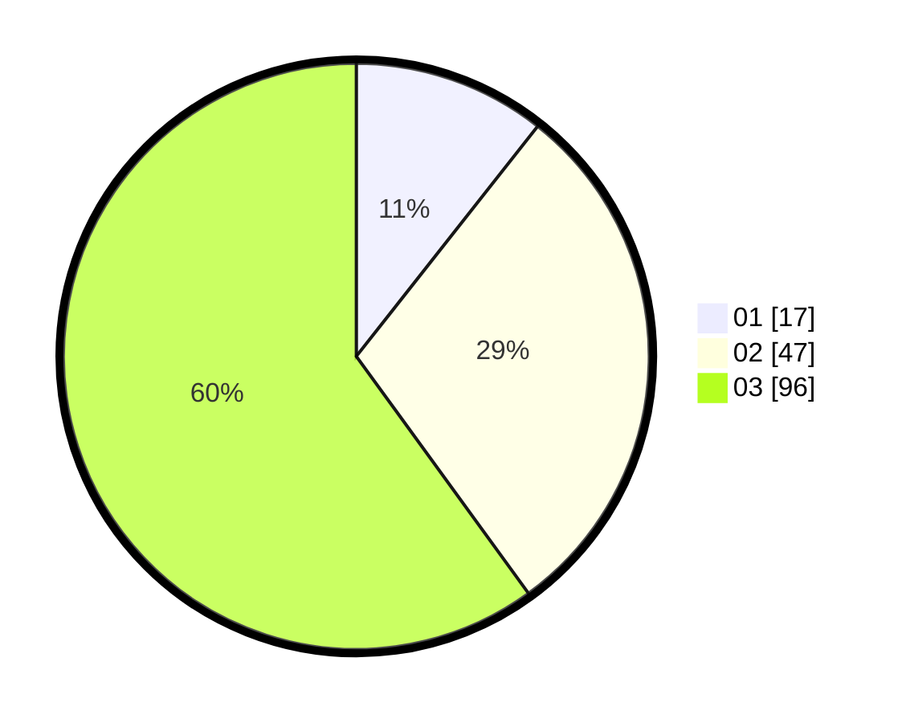

# Hasil

Hasil perolehan suara paslon dapat dilihat pada file paslon-01.txt, paslon-02.txt, dan paslon-03.txt.

Jika tidak ada, artinya data tersebut belum ada pada SIREKAP.

## Perolehan Suara

 * Paslon 01: **17**.
 * Paslon 02: **47**.
 * Paslon 03: **96**.

## Foto C Plano

https://sirekap-obj-formc.kpu.go.id/0275/pemilu/ppwp/31/74/05/10/04/3174051004005-20240214-210221--acc550cd-5354-4c74-b63d-389f3d030aee.jpg

https://sirekap-obj-formc.kpu.go.id/0275/pemilu/ppwp/31/74/05/10/04/3174051004005-20240214-202027--195124f3-2a7d-4f38-953c-287aa1a446c9.jpg

https://sirekap-obj-formc.kpu.go.id/0275/pemilu/ppwp/31/74/05/10/04/3174051004005-20240214-205806--b8259eff-7114-44d5-b5e7-0371a54fb2ca.jpg
