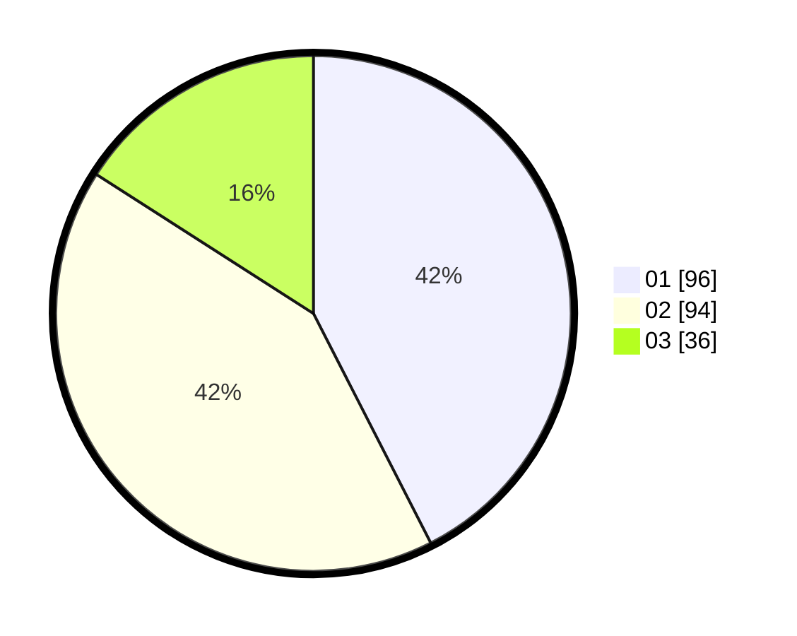

# Hasil

Hasil perolehan suara paslon dapat dilihat pada file paslon-01.txt, paslon-02.txt, dan paslon-03.txt.

Jika tidak ada, artinya data tersebut belum ada pada SIREKAP.

## Perolehan Suara

 * Paslon 01: **96**.
 * Paslon 02: **94**.
 * Paslon 03: **36**.

## Foto C Plano

https://sirekap-obj-formc.kpu.go.id/8869/pemilu/ppwp/31/74/05/10/04/3174051004013-20240214-155625--507c0e75-2744-4819-8b86-bacbb82e8664.jpg

https://sirekap-obj-formc.kpu.go.id/8869/pemilu/ppwp/31/74/05/10/04/3174051004013-20240214-155755--69d452a1-32c9-4b4a-9043-584b00ab0e1b.jpg

https://sirekap-obj-formc.kpu.go.id/8869/pemilu/ppwp/31/74/05/10/04/3174051004013-20240214-155830--9c71bbd4-c3db-4387-a680-a6cc15ad8472.jpg

## DATA PEMILIH TETAP

Jumlah pemilih dalam DPT: **292**.
 * L: **152**.
 * P: **140**.

## DATA PENGGUNA HAK PILIH

Jumlah pengguna hak pilih dalam DPT: **218**.
 * L: **108**.
 * P: **110**.

Jumlah pengguna hak pilih dalam DPTb: **9**.
 * L: **0**.
 * P: **9**.

Jumlah pengguna hak pilih dalam DPK: **0**.
 * L: **0**.
 * P: **0**.

Jumlah pengguna hak pilih: **227**.
 * L: **108**.
 * P: **119**.

## JUMLAH SUARA SAH DAN TIDAK SAH

JUMLAH SELURUH SUARA SAH: **226**.

JUMLAH SUARA TIDAK SAH: **1**.

JUMLAH SELURUH SUARA SAH DAN SUARA TIDAK SAH: **227**.
