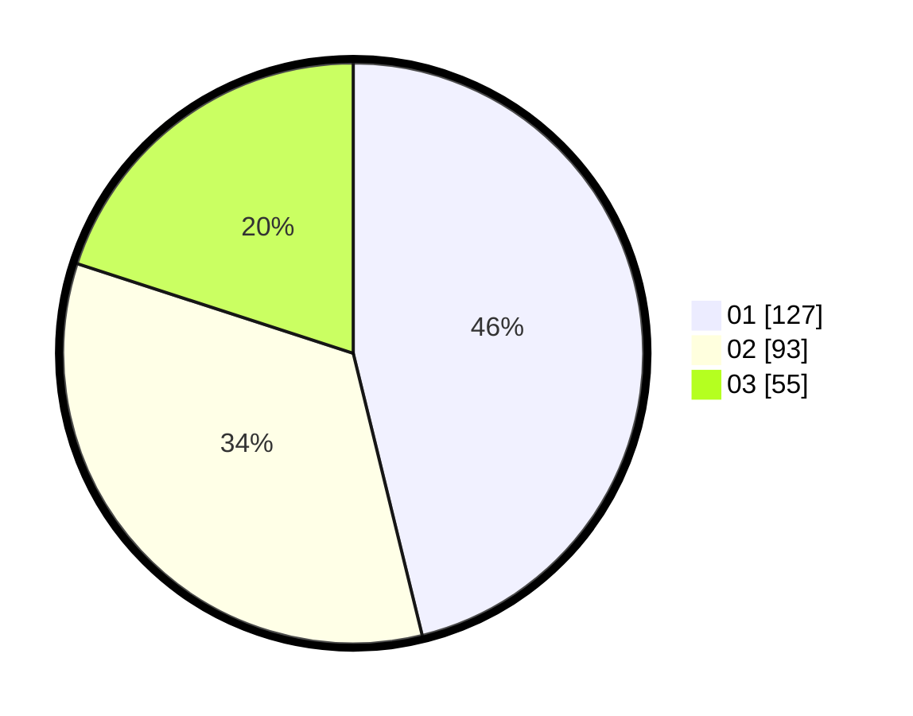

# Hasil

Hasil perolehan suara paslon dapat dilihat pada file paslon-01.txt, paslon-02.txt, dan paslon-03.txt.

Jika tidak ada, artinya data tersebut belum ada pada SIREKAP.

## Perolehan Suara

 * Paslon 01: **127**.
 * Paslon 02: **93**.
 * Paslon 03: **55**.

## Foto C Plano

https://sirekap-obj-formc.kpu.go.id/e57c/pemilu/ppwp/31/74/05/10/04/3174051004020-20240216-164445--376b0311-43df-4cd6-8aa7-d5804ba74a62.jpg

https://sirekap-obj-formc.kpu.go.id/e57c/pemilu/ppwp/31/74/05/10/04/3174051004020-20240215-070516--cb28cdd6-91d0-47c8-aab0-ad7508a0365d.jpg

https://sirekap-obj-formc.kpu.go.id/e57c/pemilu/ppwp/31/74/05/10/04/3174051004020-20240215-070548--aed15ab9-a2de-4d8c-a84c-10dab6cdb7a5.jpg

## DATA PEMILIH TETAP

Jumlah pemilih dalam DPT: **271**.
 * L: **129**.
 * P: **142**.

## DATA PENGGUNA HAK PILIH

Jumlah pengguna hak pilih dalam DPT: **237**.
 * L: **104**.
 * P: **133**.

Jumlah pengguna hak pilih dalam DPTb: **10**.
 * L: **3**.
 * P: **7**.

Jumlah pengguna hak pilih dalam DPK: **2**.
 * L: **0**.
 * P: **2**.

Jumlah pengguna hak pilih: **249**.
 * L: **107**.
 * P: **142**.

## JUMLAH SUARA SAH DAN TIDAK SAH

JUMLAH SELURUH SUARA SAH: **245**.

JUMLAH SUARA TIDAK SAH: **4**.

JUMLAH SELURUH SUARA SAH DAN SUARA TIDAK SAH: **249**.
