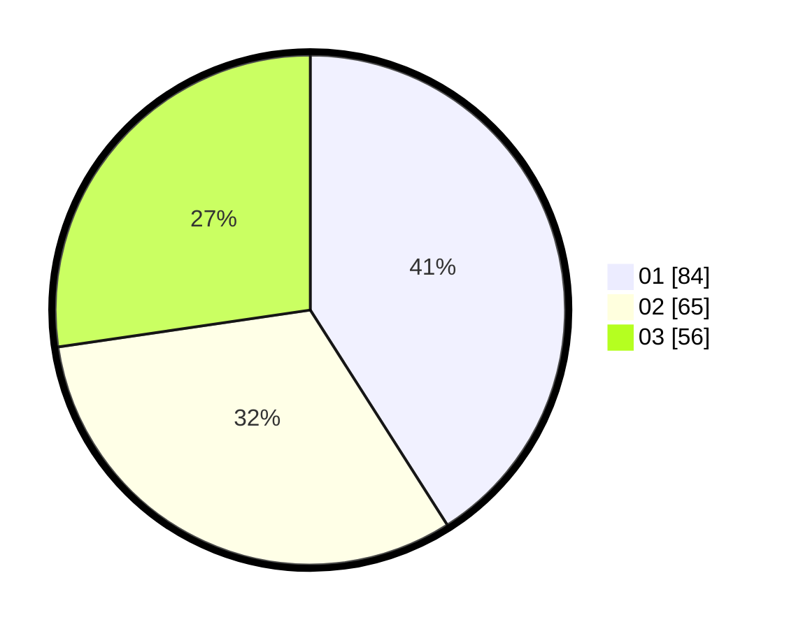

# Hasil

Hasil perolehan suara paslon dapat dilihat pada file paslon-01.txt, paslon-02.txt, dan paslon-03.txt.

Jika tidak ada, artinya data tersebut belum ada pada SIREKAP.

## Perolehan Suara

 * Paslon 01: **84**.
 * Paslon 02: **65**.
 * Paslon 03: **56**.

## Foto C Plano

https://sirekap-obj-formc.kpu.go.id/17a1/pemilu/ppwp/31/74/05/10/04/3174051004023-20240214-192750--792807c6-8443-4da0-9780-6ca8e602cfe7.jpg

https://sirekap-obj-formc.kpu.go.id/17a1/pemilu/ppwp/31/74/05/10/04/3174051004023-20240214-191545--6f6d51f2-93b3-4dd9-81be-1c27c994996f.jpg

https://sirekap-obj-formc.kpu.go.id/17a1/pemilu/ppwp/31/74/05/10/04/3174051004023-20240214-193026--311848cb-1406-4e45-8edf-5ea9f0ff5982.jpg
