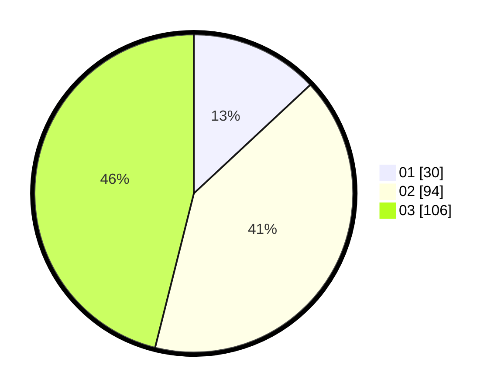

# Hasil

Hasil perolehan suara paslon dapat dilihat pada file paslon-01.txt, paslon-02.txt, dan paslon-03.txt.

Jika tidak ada, artinya data tersebut belum ada pada SIREKAP.

## Perolehan Suara

 * Paslon 01: **30**.
 * Paslon 02: **94**.
 * Paslon 03: **106**.

## Foto C Plano

https://sirekap-obj-formc.kpu.go.id/d655/pemilu/ppwp/31/74/05/10/04/3174051004031-20240216-052256--347fdd49-3c0b-43b1-9695-ead721b86f5c.jpg

https://sirekap-obj-formc.kpu.go.id/d655/pemilu/ppwp/31/74/05/10/04/3174051004031-20240216-052257--b1b4584d-fff5-4096-9c88-a53918d37e3d.jpg

https://sirekap-obj-formc.kpu.go.id/d655/pemilu/ppwp/31/74/05/10/04/3174051004031-20240216-052257--1d8979d9-b928-4feb-ace9-606fe7bc8acf.jpg

## DATA PEMILIH TETAP

Jumlah pemilih dalam DPT: **288**.
 * L: **145**.
 * P: **143**.

## DATA PENGGUNA HAK PILIH

Jumlah pengguna hak pilih dalam DPT: **212**.
 * L: **107**.
 * P: **105**.

Jumlah pengguna hak pilih dalam DPTb: **14**.
 * L: **1**.
 * P: **13**.

Jumlah pengguna hak pilih dalam DPK: **6**.
 * L: **3**.
 * P: **3**.

Jumlah pengguna hak pilih: **232**.
 * L: **111**.
 * P: **121**.

## JUMLAH SUARA SAH DAN TIDAK SAH

JUMLAH SELURUH SUARA SAH: **230**.

JUMLAH SUARA TIDAK SAH: **2**.

JUMLAH SELURUH SUARA SAH DAN SUARA TIDAK SAH: **232**.
