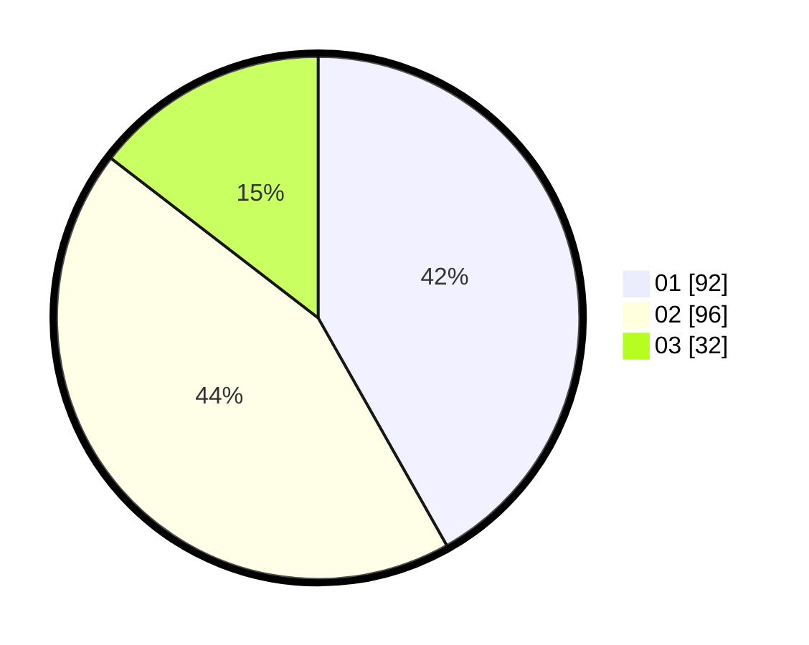

# Hasil

Hasil perolehan suara paslon dapat dilihat pada file paslon-01.txt, paslon-02.txt, dan paslon-03.txt.

Jika tidak ada, artinya data tersebut belum ada pada SIREKAP.

## Perolehan Suara

 * Paslon 01: **92**.
 * Paslon 02: **96**.
 * Paslon 03: **32**.

## Foto C Plano

https://sirekap-obj-formc.kpu.go.id/754f/pemilu/ppwp/31/74/05/10/04/3174051004038-20240214-190642--4c395c46-bb7b-48dd-9cf3-66cd8b0ee4a4.jpg

https://sirekap-obj-formc.kpu.go.id/754f/pemilu/ppwp/31/74/05/10/04/3174051004038-20240214-190555--1125fbea-3acf-47ba-b060-22376bac9dbf.jpg

https://sirekap-obj-formc.kpu.go.id/754f/pemilu/ppwp/31/74/05/10/04/3174051004038-20240214-190739--85584128-fe68-45de-8af3-6104fa6a9027.jpg

## DATA PEMILIH TETAP

Jumlah pemilih dalam DPT: **283**.
 * L: **141**.
 * P: **142**.

## DATA PENGGUNA HAK PILIH

Jumlah pengguna hak pilih dalam DPT: **218**.
 * L: **104**.
 * P: **114**.

Jumlah pengguna hak pilih dalam DPTb: **5**.
 * L: **1**.
 * P: **4**.

Jumlah pengguna hak pilih dalam DPK: **3**.
 * L: **3**.
 * P: **0**.

Jumlah pengguna hak pilih: **226**.
 * L: **108**.
 * P: **118**.

## JUMLAH SUARA SAH DAN TIDAK SAH

JUMLAH SELURUH SUARA SAH: **220**.

JUMLAH SUARA TIDAK SAH: **6**.

JUMLAH SELURUH SUARA SAH DAN SUARA TIDAK SAH: **226**.
