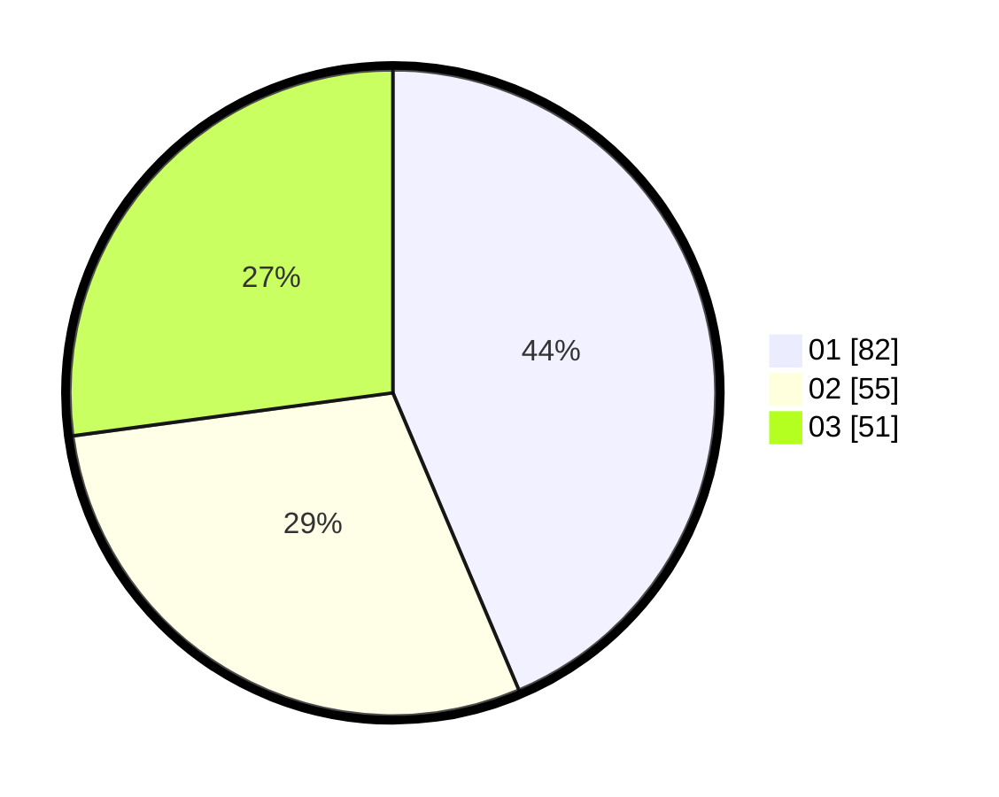

# Hasil

Hasil perolehan suara paslon dapat dilihat pada file paslon-01.txt, paslon-02.txt, dan paslon-03.txt.

Jika tidak ada, artinya data tersebut belum ada pada SIREKAP.

## Perolehan Suara

 * Paslon 01: **82**.
 * Paslon 02: **55**.
 * Paslon 03: **51**.

## Foto C Plano

https://sirekap-obj-formc.kpu.go.id/0e7f/pemilu/ppwp/31/74/05/10/04/3174051004050-20240214-221900--ea5dc583-d536-4241-a4d7-f8fae2febd11.jpg

https://sirekap-obj-formc.kpu.go.id/0e7f/pemilu/ppwp/31/74/05/10/04/3174051004050-20240214-192027--029894f3-23a5-40c5-aace-6d4ab233d4e3.jpg

https://sirekap-obj-formc.kpu.go.id/0e7f/pemilu/ppwp/31/74/05/10/04/3174051004050-20240214-192300--e4a9a713-06c9-48e8-b642-e684f62a78c9.jpg
