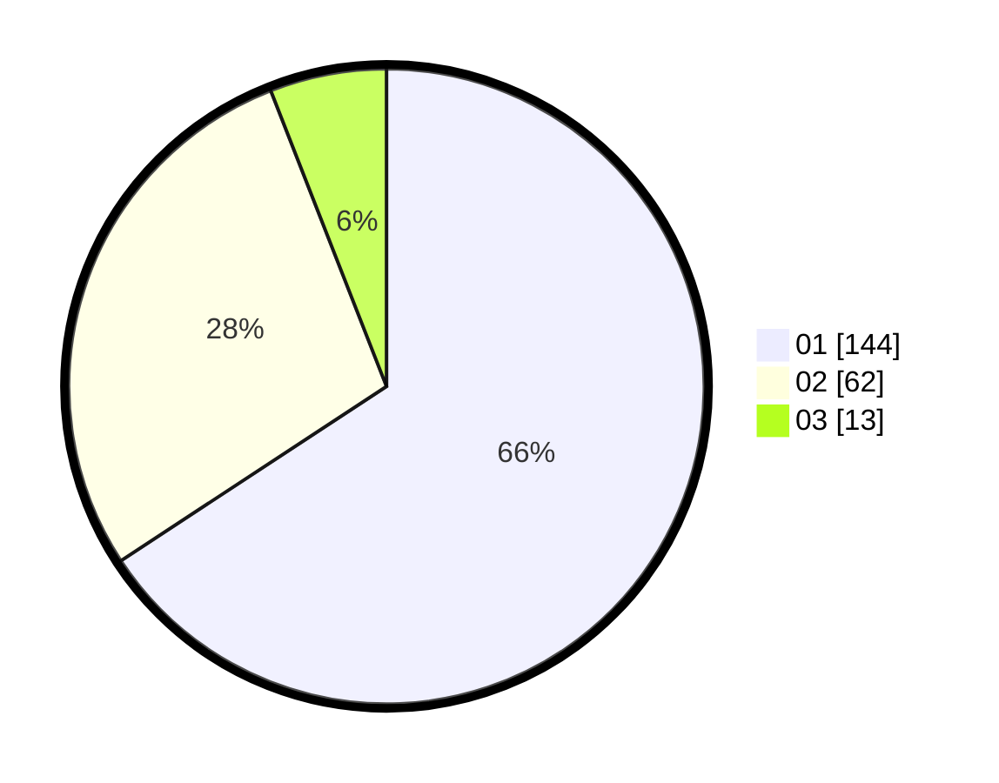

# Hasil

Hasil perolehan suara paslon dapat dilihat pada file paslon-01.txt, paslon-02.txt, dan paslon-03.txt.

Jika tidak ada, artinya data tersebut belum ada pada SIREKAP.

## Perolehan Suara

 * Paslon 01: **144**.
 * Paslon 02: **62**.
 * Paslon 03: **13**.

## Foto C Plano

https://sirekap-obj-formc.kpu.go.id/e2f9/pemilu/ppwp/31/74/05/10/04/3174051004056-20240214-192730--6ae21dc7-7d96-4596-b744-ef64db9da81b.jpg

https://sirekap-obj-formc.kpu.go.id/e2f9/pemilu/ppwp/31/74/05/10/04/3174051004056-20240214-200440--a78c14f2-7490-4d1a-a908-74f137174047.jpg

https://sirekap-obj-formc.kpu.go.id/e2f9/pemilu/ppwp/31/74/05/10/04/3174051004056-20240214-193702--fe465f4e-66cd-4c82-bcb4-710b19bbf83a.jpg

## DATA PEMILIH TETAP

Jumlah pemilih dalam DPT: **263**.
 * L: **131**.
 * P: **132**.

## DATA PENGGUNA HAK PILIH

Jumlah pengguna hak pilih dalam DPT: **220**.
 * L: **108**.
 * P: **112**.

Jumlah pengguna hak pilih dalam DPTb: **0**.
 * L: **0**.
 * P: **0**.

Jumlah pengguna hak pilih dalam DPK: **0**.
 * L: **0**.
 * P: **0**.

Jumlah pengguna hak pilih: **220**.
 * L: **108**.
 * P: **112**.

## JUMLAH SUARA SAH DAN TIDAK SAH

JUMLAH SELURUH SUARA SAH: **219**.

JUMLAH SUARA TIDAK SAH: **1**.

JUMLAH SELURUH SUARA SAH DAN SUARA TIDAK SAH: **220**.
