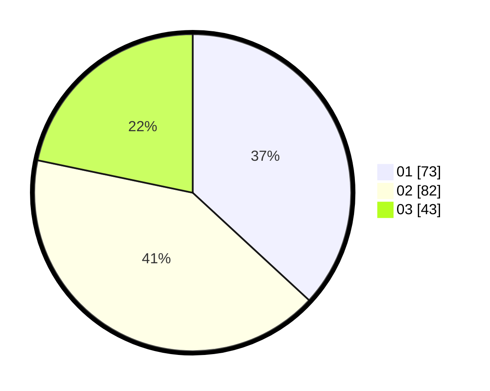

# Hasil

Hasil perolehan suara paslon dapat dilihat pada file paslon-01.txt, paslon-02.txt, dan paslon-03.txt.

Jika tidak ada, artinya data tersebut belum ada pada SIREKAP.

## Perolehan Suara

 * Paslon 01: **73**.
 * Paslon 02: **82**.
 * Paslon 03: **43**.

## Foto C Plano

https://sirekap-obj-formc.kpu.go.id/c0b9/pemilu/ppwp/31/74/05/10/04/3174051004067-20240216-135142--108a4bf4-14a0-4723-a99c-51c32ac84c9f.jpg

https://sirekap-obj-formc.kpu.go.id/c0b9/pemilu/ppwp/31/74/05/10/04/3174051004067-20240216-135144--f837635c-0542-4a7d-9ba5-35e081243984.jpg

https://sirekap-obj-formc.kpu.go.id/c0b9/pemilu/ppwp/31/74/05/10/04/3174051004067-20240216-135143--83ccb849-1414-4c43-b2cc-afca7031011a.jpg

## DATA PEMILIH TETAP

Jumlah pemilih dalam DPT: **256**.
 * L: **130**.
 * P: **126**.

## DATA PENGGUNA HAK PILIH

Jumlah pengguna hak pilih dalam DPT: **198**.
 * L: **97**.
 * P: **101**.

Jumlah pengguna hak pilih dalam DPTb: **4**.
 * L: **2**.
 * P: **2**.

Jumlah pengguna hak pilih dalam DPK: **0**.
 * L: **0**.
 * P: **0**.

Jumlah pengguna hak pilih: **202**.
 * L: **99**.
 * P: **103**.

## JUMLAH SUARA SAH DAN TIDAK SAH

JUMLAH SELURUH SUARA SAH: **198**.

JUMLAH SUARA TIDAK SAH: **4**.

JUMLAH SELURUH SUARA SAH DAN SUARA TIDAK SAH: **202**.
