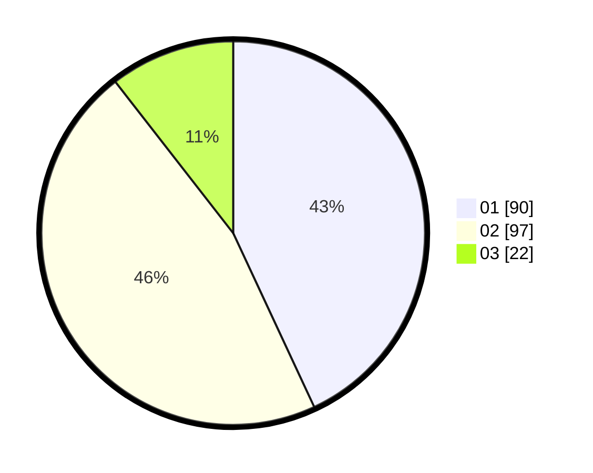

# Hasil

Hasil perolehan suara paslon dapat dilihat pada file paslon-01.txt, paslon-02.txt, dan paslon-03.txt.

Jika tidak ada, artinya data tersebut belum ada pada SIREKAP.

## Perolehan Suara

 * Paslon 01: **90**.
 * Paslon 02: **97**.
 * Paslon 03: **22**.

## Foto C Plano

https://sirekap-obj-formc.kpu.go.id/1ff1/pemilu/ppwp/31/74/05/10/04/3174051004074-20240214-175310--0242154d-6748-4dca-985f-93674f04b879.jpg

https://sirekap-obj-formc.kpu.go.id/1ff1/pemilu/ppwp/31/74/05/10/04/3174051004074-20240214-181501--9b207fb1-46bd-4d8d-b886-ed30a060163b.jpg

https://sirekap-obj-formc.kpu.go.id/1ff1/pemilu/ppwp/31/74/05/10/04/3174051004074-20240214-184453--5eb19c64-a9e6-454a-92cb-9840fb95b4b4.jpg

## DATA PEMILIH TETAP

Jumlah pemilih dalam DPT: **268**.
 * L: **142**.
 * P: **126**.

## DATA PENGGUNA HAK PILIH

Jumlah pengguna hak pilih dalam DPT: **208**.
 * L: **115**.
 * P: **93**.

Jumlah pengguna hak pilih dalam DPTb: **5**.
 * L: **3**.
 * P: **2**.

Jumlah pengguna hak pilih dalam DPK: **0**.
 * L: **0**.
 * P: **0**.

Jumlah pengguna hak pilih: **213**.
 * L: **118**.
 * P: **95**.

## JUMLAH SUARA SAH DAN TIDAK SAH

JUMLAH SELURUH SUARA SAH: **209**.

JUMLAH SUARA TIDAK SAH: **4**.

JUMLAH SELURUH SUARA SAH DAN SUARA TIDAK SAH: **213**.
