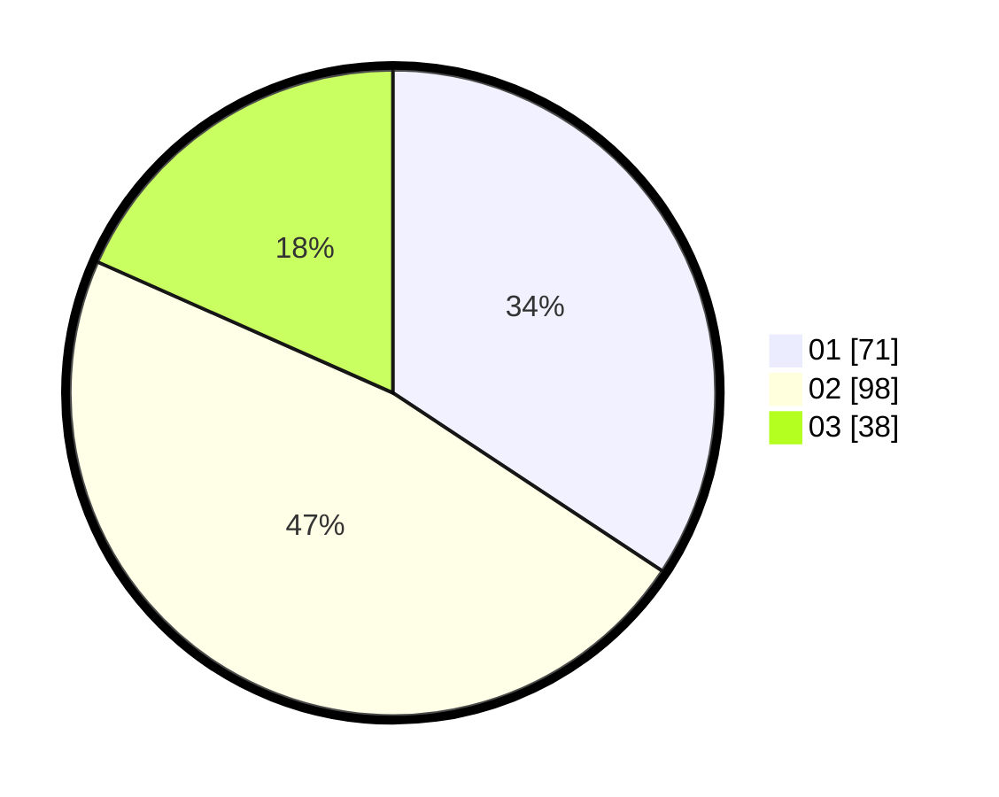

# Hasil

Hasil perolehan suara paslon dapat dilihat pada file paslon-01.txt, paslon-02.txt, dan paslon-03.txt.

Jika tidak ada, artinya data tersebut belum ada pada SIREKAP.

## Perolehan Suara

 * Paslon 01: **71**.
 * Paslon 02: **98**.
 * Paslon 03: **38**.

## Foto C Plano

https://sirekap-obj-formc.kpu.go.id/c29e/pemilu/ppwp/31/74/05/10/04/3174051004075-20240214-222149--bae35c0a-12fc-462a-973d-c5271c36d577.jpg

https://sirekap-obj-formc.kpu.go.id/c29e/pemilu/ppwp/31/74/05/10/04/3174051004075-20240214-222518--c043cb2f-cb9e-47de-903c-a636b1c7bf2a.jpg

https://sirekap-obj-formc.kpu.go.id/c29e/pemilu/ppwp/31/74/05/10/04/3174051004075-20240214-222618--8592a96d-cc53-4576-bab2-bd051d568a74.jpg

## DATA PEMILIH TETAP

Jumlah pemilih dalam DPT: **260**.
 * L: **130**.
 * P: **130**.

## DATA PENGGUNA HAK PILIH

Jumlah pengguna hak pilih dalam DPT: **206**.
 * L: **95**.
 * P: **111**.

Jumlah pengguna hak pilih dalam DPTb: **5**.
 * L: **3**.
 * P: **2**.

Jumlah pengguna hak pilih dalam DPK: **0**.
 * L: **0**.
 * P: **0**.

Jumlah pengguna hak pilih: **211**.
 * L: **98**.
 * P: **113**.

## JUMLAH SUARA SAH DAN TIDAK SAH

JUMLAH SELURUH SUARA SAH: **207**.

JUMLAH SUARA TIDAK SAH: **4**.

JUMLAH SELURUH SUARA SAH DAN SUARA TIDAK SAH: **211**.
