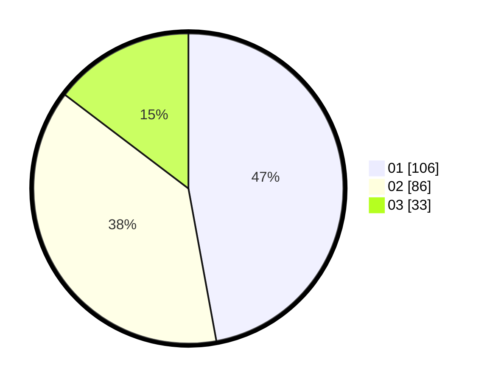

# Hasil

Hasil perolehan suara paslon dapat dilihat pada file paslon-01.txt, paslon-02.txt, dan paslon-03.txt.

Jika tidak ada, artinya data tersebut belum ada pada SIREKAP.

## Perolehan Suara

 * Paslon 01: **106**.
 * Paslon 02: **86**.
 * Paslon 03: **33**.

## Foto C Plano

https://sirekap-obj-formc.kpu.go.id/cd33/pemilu/ppwp/31/74/05/10/04/3174051004076-20240214-230032--bc2ba094-50e9-4b3b-ae81-ec0064aff436.jpg

https://sirekap-obj-formc.kpu.go.id/cd33/pemilu/ppwp/31/74/05/10/04/3174051004076-20240214-225814--926663fb-7dc2-4689-9b4f-9a45bf29198c.jpg

https://sirekap-obj-formc.kpu.go.id/cd33/pemilu/ppwp/31/74/05/10/04/3174051004076-20240214-225954--64d43dc4-32a7-4692-9a06-e5b3555fc4bf.jpg
