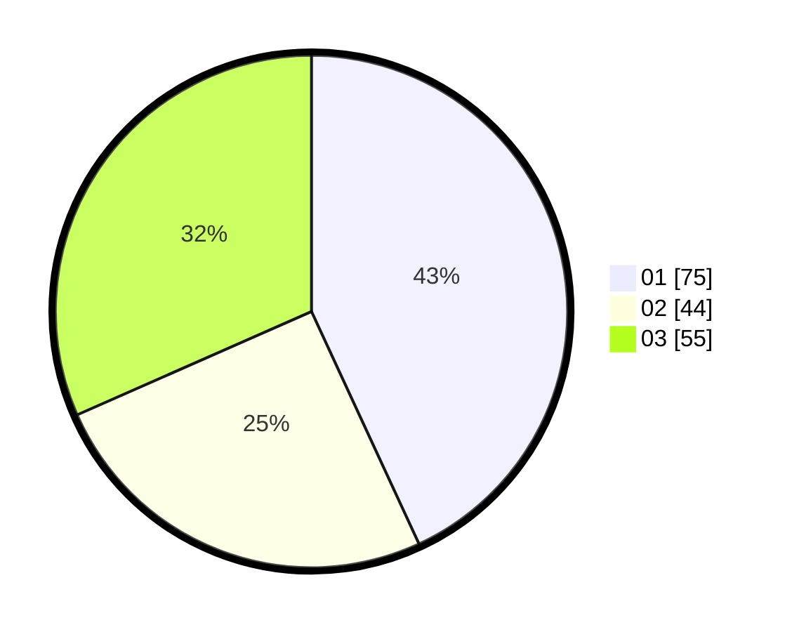

# Hasil

Hasil perolehan suara paslon dapat dilihat pada file paslon-01.txt, paslon-02.txt, dan paslon-03.txt.

Jika tidak ada, artinya data tersebut belum ada pada SIREKAP.

## Perolehan Suara

 * Paslon 01: **75**.
 * Paslon 02: **44**.
 * Paslon 03: **55**.

## Foto C Plano

https://sirekap-obj-formc.kpu.go.id/490e/pemilu/ppwp/31/74/05/10/04/3174051004080-20240214-155552--071b28d2-6047-4877-b8b1-88ede1e29e6d.jpg

https://sirekap-obj-formc.kpu.go.id/490e/pemilu/ppwp/31/74/05/10/04/3174051004080-20240214-155410--b76e49db-3e1e-415e-9147-f5ffbea7f7bb.jpg

https://sirekap-obj-formc.kpu.go.id/490e/pemilu/ppwp/31/74/05/10/04/3174051004080-20240214-232759--f1886e06-2727-48f2-a0b7-6db1aab40263.jpg

## DATA PEMILIH TETAP

Jumlah pemilih dalam DPT: **205**.
 * L: **92**.
 * P: **113**.

## DATA PENGGUNA HAK PILIH

Jumlah pengguna hak pilih dalam DPT: **165**.
 * L: **72**.
 * P: **93**.

Jumlah pengguna hak pilih dalam DPTb: **10**.
 * L: **2**.
 * P: **8**.

Jumlah pengguna hak pilih dalam DPK: **2**.
 * L: **0**.
 * P: **2**.

Jumlah pengguna hak pilih: **177**.
 * L: **74**.
 * P: **103**.

## JUMLAH SUARA SAH DAN TIDAK SAH

JUMLAH SELURUH SUARA SAH: **174**.

JUMLAH SUARA TIDAK SAH: **3**.

JUMLAH SELURUH SUARA SAH DAN SUARA TIDAK SAH: **177**.
