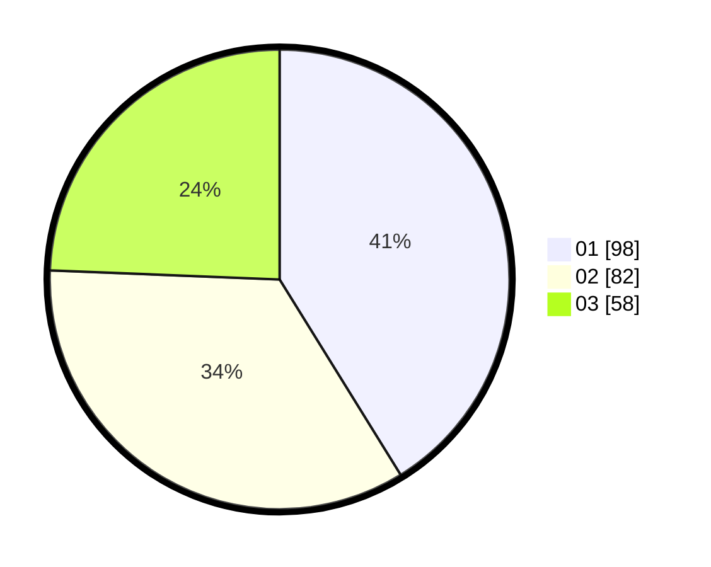

# Hasil

Hasil perolehan suara paslon dapat dilihat pada file paslon-01.txt, paslon-02.txt, dan paslon-03.txt.

Jika tidak ada, artinya data tersebut belum ada pada SIREKAP.

## Perolehan Suara

 * Paslon 01: **98**.
 * Paslon 02: **82**.
 * Paslon 03: **58**.

## Foto C Plano

https://sirekap-obj-formc.kpu.go.id/b37b/pemilu/ppwp/31/74/05/10/04/3174051004088-20240215-020646--261dbc0d-4639-478a-a08c-dbbd9c9a549d.jpg

https://sirekap-obj-formc.kpu.go.id/b37b/pemilu/ppwp/31/74/05/10/04/3174051004088-20240215-020709--123061ee-ab25-4436-869c-213e1600f073.jpg

https://sirekap-obj-formc.kpu.go.id/b37b/pemilu/ppwp/31/74/05/10/04/3174051004088-20240215-020657--231dda6d-28d0-4318-a18c-25927543b3d1.jpg

## DATA PEMILIH TETAP

Jumlah pemilih dalam DPT: **263**.
 * L: **131**.
 * P: **132**.

## DATA PENGGUNA HAK PILIH

Jumlah pengguna hak pilih dalam DPT: **234**.
 * L: **114**.
 * P: **120**.

Jumlah pengguna hak pilih dalam DPTb: **5**.
 * L: **1**.
 * P: **4**.

Jumlah pengguna hak pilih dalam DPK: **1**.
 * L: **0**.
 * P: **1**.

Jumlah pengguna hak pilih: **240**.
 * L: **115**.
 * P: **125**.

## JUMLAH SUARA SAH DAN TIDAK SAH

JUMLAH SELURUH SUARA SAH: **238**.

JUMLAH SUARA TIDAK SAH: **2**.

JUMLAH SELURUH SUARA SAH DAN SUARA TIDAK SAH: **240**.
