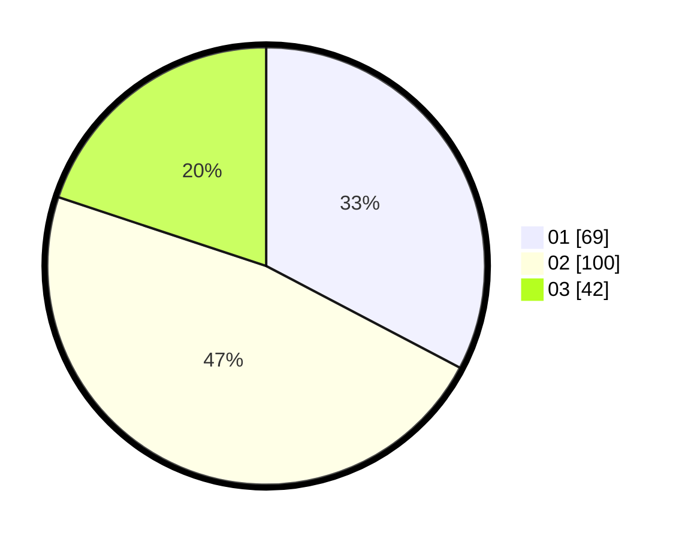

# Hasil

Hasil perolehan suara paslon dapat dilihat pada file paslon-01.txt, paslon-02.txt, dan paslon-03.txt.

Jika tidak ada, artinya data tersebut belum ada pada SIREKAP.

## Perolehan Suara

 * Paslon 01: **69**.
 * Paslon 02: **100**.
 * Paslon 03: **42**.

## Foto C Plano

https://sirekap-obj-formc.kpu.go.id/cd51/pemilu/ppwp/31/74/05/10/04/3174051004093-20240214-194121--cd94f822-c952-4d29-ad96-caf3f823350a.jpg

https://sirekap-obj-formc.kpu.go.id/cd51/pemilu/ppwp/31/74/05/10/04/3174051004093-20240214-194143--6a61014a-b3c5-4366-876a-77c6518556ae.jpg

https://sirekap-obj-formc.kpu.go.id/cd51/pemilu/ppwp/31/74/05/10/04/3174051004093-20240214-194132--4d1d6008-c49c-4ce0-a797-8a2e10446c9d.jpg

## DATA PEMILIH TETAP

Jumlah pemilih dalam DPT: **276**.
 * L: **138**.
 * P: **138**.

## DATA PENGGUNA HAK PILIH

Jumlah pengguna hak pilih dalam DPT: **207**.
 * L: **98**.
 * P: **109**.

Jumlah pengguna hak pilih dalam DPTb: **8**.
 * L: **5**.
 * P: **3**.

Jumlah pengguna hak pilih dalam DPK: **0**.
 * L: **0**.
 * P: **0**.

Jumlah pengguna hak pilih: **215**.
 * L: **103**.
 * P: **112**.

## JUMLAH SUARA SAH DAN TIDAK SAH

JUMLAH SELURUH SUARA SAH: **211**.

JUMLAH SUARA TIDAK SAH: **4**.

JUMLAH SELURUH SUARA SAH DAN SUARA TIDAK SAH: **215**.
