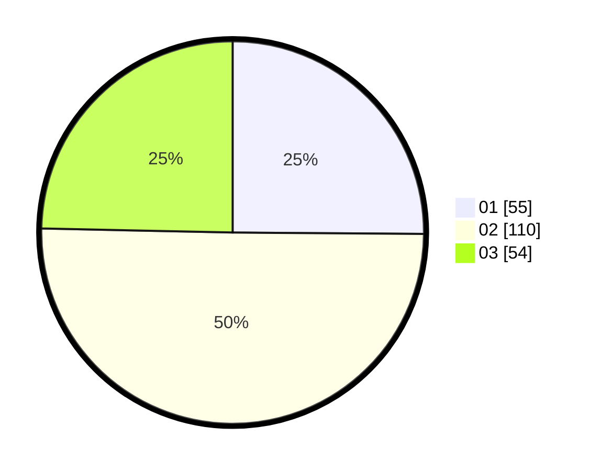

# Hasil

Hasil perolehan suara paslon dapat dilihat pada file paslon-01.txt, paslon-02.txt, dan paslon-03.txt.

Jika tidak ada, artinya data tersebut belum ada pada SIREKAP.

## Perolehan Suara

 * Paslon 01: **55**.
 * Paslon 02: **110**.
 * Paslon 03: **54**.

## Foto C Plano

https://sirekap-obj-formc.kpu.go.id/9dae/pemilu/ppwp/31/74/05/10/04/3174051004106-20240215-002820--def4d805-62d6-45db-8b55-c401f78735be.jpg

https://sirekap-obj-formc.kpu.go.id/9dae/pemilu/ppwp/31/74/05/10/04/3174051004106-20240215-002716--d8b533b6-548c-445d-8f5a-6857f3d1ae9d.jpg

https://sirekap-obj-formc.kpu.go.id/9dae/pemilu/ppwp/31/74/05/10/04/3174051004106-20240215-002625--141f6118-f68b-4776-af75-ac6d803a569a.jpg
