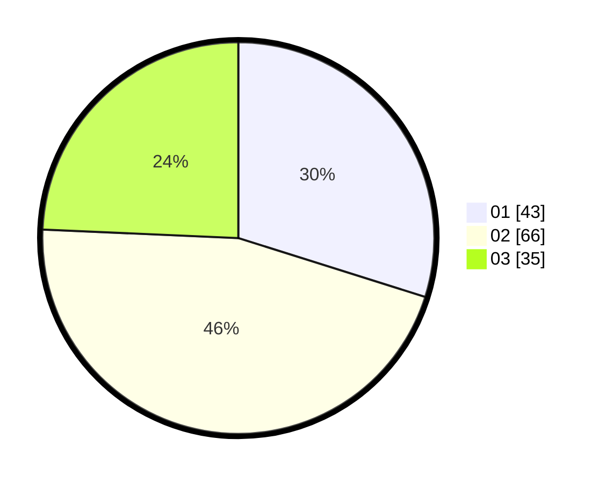

# Hasil

Hasil perolehan suara paslon dapat dilihat pada file paslon-01.txt, paslon-02.txt, dan paslon-03.txt.

Jika tidak ada, artinya data tersebut belum ada pada SIREKAP.

## Perolehan Suara

 * Paslon 01: **43**.
 * Paslon 02: **66**.
 * Paslon 03: **35**.

## Foto C Plano

https://sirekap-obj-formc.kpu.go.id/e2d8/pemilu/ppwp/31/74/05/10/04/3174051004109-20240215-014142--d5799504-4bf6-4dff-a1e0-8f1b4f03786d.jpg

https://sirekap-obj-formc.kpu.go.id/e2d8/pemilu/ppwp/31/74/05/10/04/3174051004109-20240215-014231--58cefa5e-a028-45bd-87e2-e06a681495e3.jpg

https://sirekap-obj-formc.kpu.go.id/e2d8/pemilu/ppwp/31/74/05/10/04/3174051004109-20240215-014313--2dbb0a56-b970-42f9-a081-8d3d60adefd3.jpg

## DATA PEMILIH TETAP

Jumlah pemilih dalam DPT: **244**.
 * L: **118**.
 * P: **126**.

## DATA PENGGUNA HAK PILIH

Jumlah pengguna hak pilih dalam DPT: **191**.
 * L: **91**.
 * P: **100**.

Jumlah pengguna hak pilih dalam DPTb: **2**.
 * L: **1**.
 * P: **1**.

Jumlah pengguna hak pilih dalam DPK: **1**.
 * L: **0**.
 * P: **1**.

Jumlah pengguna hak pilih: **194**.
 * L: **92**.
 * P: **102**.

## JUMLAH SUARA SAH DAN TIDAK SAH

JUMLAH SELURUH SUARA SAH: **194**.

JUMLAH SUARA TIDAK SAH: **0**.

JUMLAH SELURUH SUARA SAH DAN SUARA TIDAK SAH: **194**.
