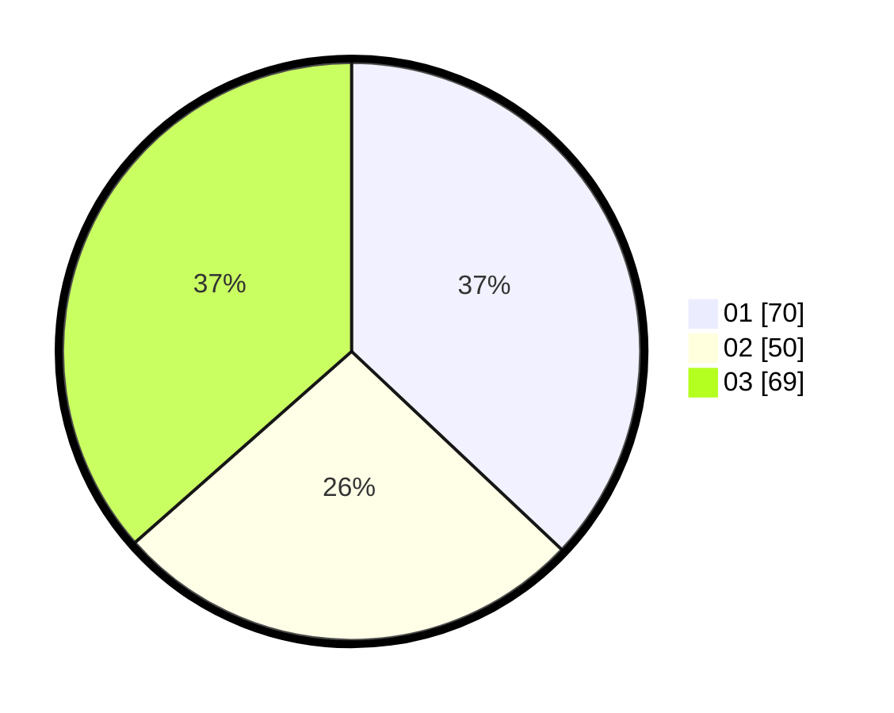

# Hasil

Hasil perolehan suara paslon dapat dilihat pada file paslon-01.txt, paslon-02.txt, dan paslon-03.txt.

Jika tidak ada, artinya data tersebut belum ada pada SIREKAP.

## Perolehan Suara

 * Paslon 01: **70**.
 * Paslon 02: **50**.
 * Paslon 03: **69**.

## Foto C Plano

https://sirekap-obj-formc.kpu.go.id/5439/pemilu/ppwp/31/74/05/10/04/3174051004111-20240216-190419--21e04182-615c-4339-9ba2-89f2469dac8a.jpg

https://sirekap-obj-formc.kpu.go.id/5439/pemilu/ppwp/31/74/05/10/04/3174051004111-20240216-190420--5bdf5fac-9113-473f-9105-edd15de70ee3.jpg

https://sirekap-obj-formc.kpu.go.id/5439/pemilu/ppwp/31/74/05/10/04/3174051004111-20240216-190420--d946cfaa-7bda-4afc-afd0-b50d3ae5fda8.jpg

## DATA PEMILIH TETAP

Jumlah pemilih dalam DPT: **237**.
 * L: **108**.
 * P: **129**.

## DATA PENGGUNA HAK PILIH

Jumlah pengguna hak pilih dalam DPT: **186**.
 * L: **84**.
 * P: **102**.

Jumlah pengguna hak pilih dalam DPTb: **8**.
 * L: **4**.
 * P: **4**.

Jumlah pengguna hak pilih dalam DPK: **1**.
 * L: **1**.
 * P: **0**.

Jumlah pengguna hak pilih: **195**.
 * L: **89**.
 * P: **106**.

## JUMLAH SUARA SAH DAN TIDAK SAH

JUMLAH SELURUH SUARA SAH: **189**.

JUMLAH SUARA TIDAK SAH: **0**.

JUMLAH SELURUH SUARA SAH DAN SUARA TIDAK SAH: **189**.
