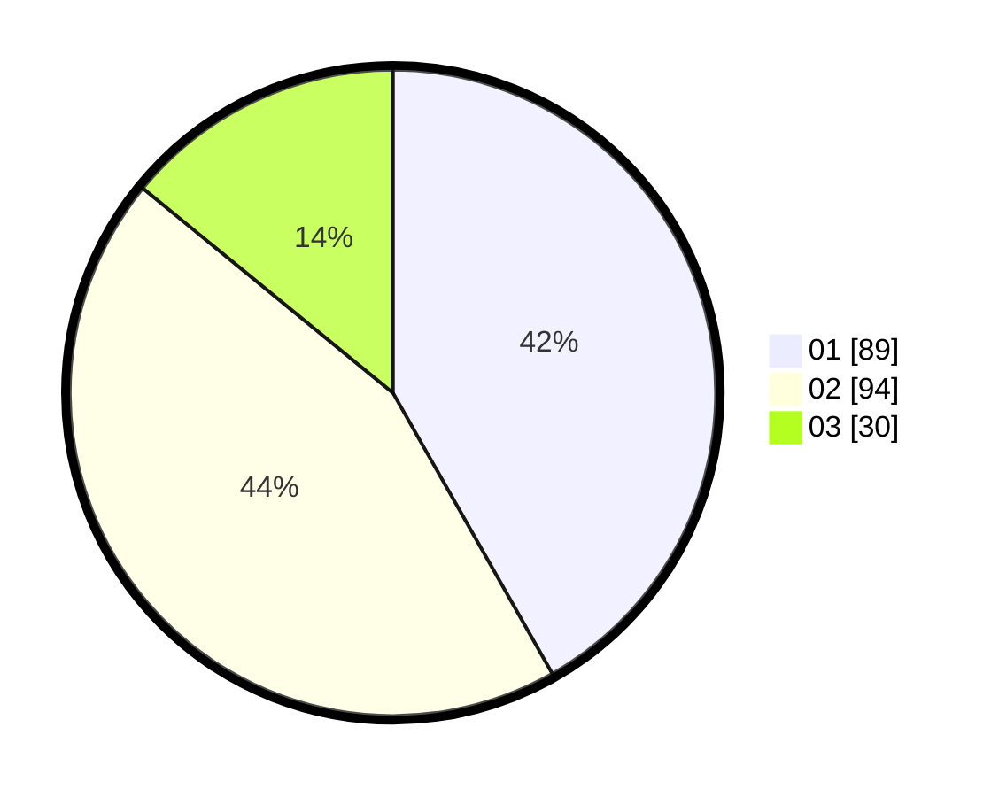

# Hasil

Hasil perolehan suara paslon dapat dilihat pada file paslon-01.txt, paslon-02.txt, dan paslon-03.txt.

Jika tidak ada, artinya data tersebut belum ada pada SIREKAP.

## Perolehan Suara

 * Paslon 01: **89**.
 * Paslon 02: **94**.
 * Paslon 03: **30**.

## Foto C Plano

https://sirekap-obj-formc.kpu.go.id/0628/pemilu/ppwp/31/74/05/10/04/3174051004114-20240216-015208--2bb136b6-0a0f-40e5-921f-e354b34c0cf2.jpg

https://sirekap-obj-formc.kpu.go.id/0628/pemilu/ppwp/31/74/05/10/04/3174051004114-20240216-015210--a53d0f32-d4f2-430a-abfc-b12fc30cab15.jpg

https://sirekap-obj-formc.kpu.go.id/0628/pemilu/ppwp/31/74/05/10/04/3174051004114-20240216-015209--7801d3c7-ba92-41d5-8659-e8c96f5c08a1.jpg

## DATA PEMILIH TETAP

Jumlah pemilih dalam DPT: **258**.
 * L: **125**.
 * P: **133**.

## DATA PENGGUNA HAK PILIH

Jumlah pengguna hak pilih dalam DPT: **213**.
 * L: **97**.
 * P: **116**.

Jumlah pengguna hak pilih dalam DPTb: **6**.
 * L: **2**.
 * P: **4**.

Jumlah pengguna hak pilih dalam DPK: **0**.
 * L: **0**.
 * P: **0**.

Jumlah pengguna hak pilih: **219**.
 * L: **99**.
 * P: **120**.

## JUMLAH SUARA SAH DAN TIDAK SAH

JUMLAH SELURUH SUARA SAH: **213**.

JUMLAH SUARA TIDAK SAH: **6**.

JUMLAH SELURUH SUARA SAH DAN SUARA TIDAK SAH: **219**.
