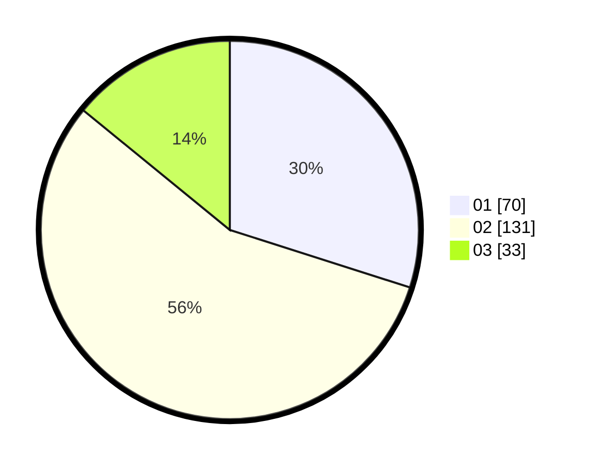

# Hasil

Hasil perolehan suara paslon dapat dilihat pada file paslon-01.txt, paslon-02.txt, dan paslon-03.txt.

Jika tidak ada, artinya data tersebut belum ada pada SIREKAP.

## Perolehan Suara

 * Paslon 01: **70**.
 * Paslon 02: **131**.
 * Paslon 03: **33**.

## Foto C Plano

https://sirekap-obj-formc.kpu.go.id/c3f3/pemilu/ppwp/31/74/05/10/04/3174051004123-20240216-030259--8119aa31-925e-4ee7-87eb-d95fc5a7a4b7.jpg

https://sirekap-obj-formc.kpu.go.id/c3f3/pemilu/ppwp/31/74/05/10/04/3174051004123-20240216-030239--748093f4-123c-4e0a-b7ad-4115751f380a.jpg

https://sirekap-obj-formc.kpu.go.id/c3f3/pemilu/ppwp/31/74/05/10/04/3174051004123-20240216-030235--ff3d651f-42b3-46c4-8cb8-1f207269e963.jpg

## DATA PEMILIH TETAP

Jumlah pemilih dalam DPT: **276**.
 * L: **137**.
 * P: **139**.

## DATA PENGGUNA HAK PILIH

Jumlah pengguna hak pilih dalam DPT: **223**.
 * L: **102**.
 * P: **121**.

Jumlah pengguna hak pilih dalam DPTb: **5**.
 * L: **1**.
 * P: **4**.

Jumlah pengguna hak pilih dalam DPK: **6**.
 * L: **3**.
 * P: **3**.

Jumlah pengguna hak pilih: **234**.
 * L: **106**.
 * P: **128**.

## JUMLAH SUARA SAH DAN TIDAK SAH

JUMLAH SELURUH SUARA SAH: **234**.

JUMLAH SUARA TIDAK SAH: **0**.

JUMLAH SELURUH SUARA SAH DAN SUARA TIDAK SAH: **234**.
