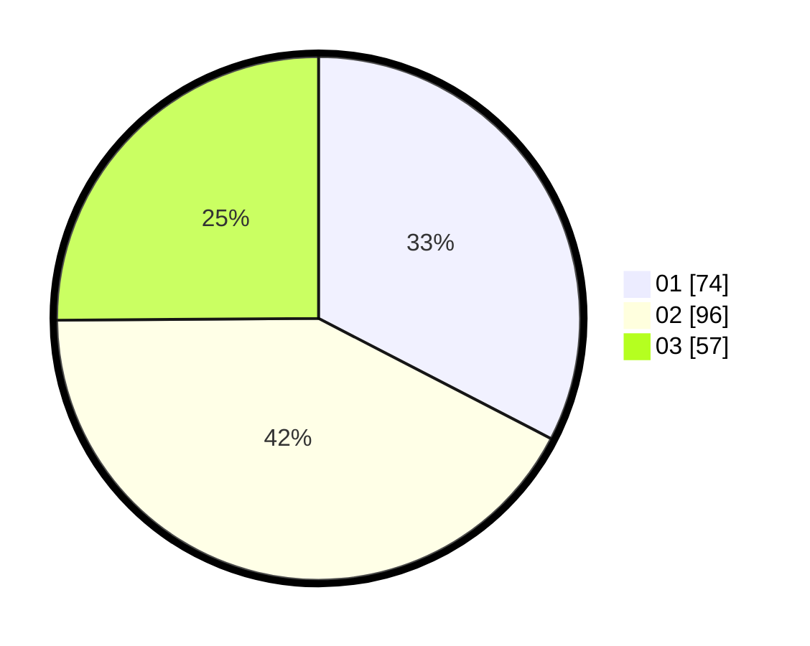

# Hasil

Hasil perolehan suara paslon dapat dilihat pada file paslon-01.txt, paslon-02.txt, dan paslon-03.txt.

Jika tidak ada, artinya data tersebut belum ada pada SIREKAP.

## Perolehan Suara

 * Paslon 01: **74**.
 * Paslon 02: **96**.
 * Paslon 03: **57**.

## Foto C Plano

https://sirekap-obj-formc.kpu.go.id/db9b/pemilu/ppwp/31/74/05/10/04/3174051004124-20240214-155229--315357fb-31cd-4340-ab99-69068fd98030.jpg

https://sirekap-obj-formc.kpu.go.id/db9b/pemilu/ppwp/31/74/05/10/04/3174051004124-20240214-155356--c5c3a459-7a4b-4a1c-9d19-dda54f2043a0.jpg
