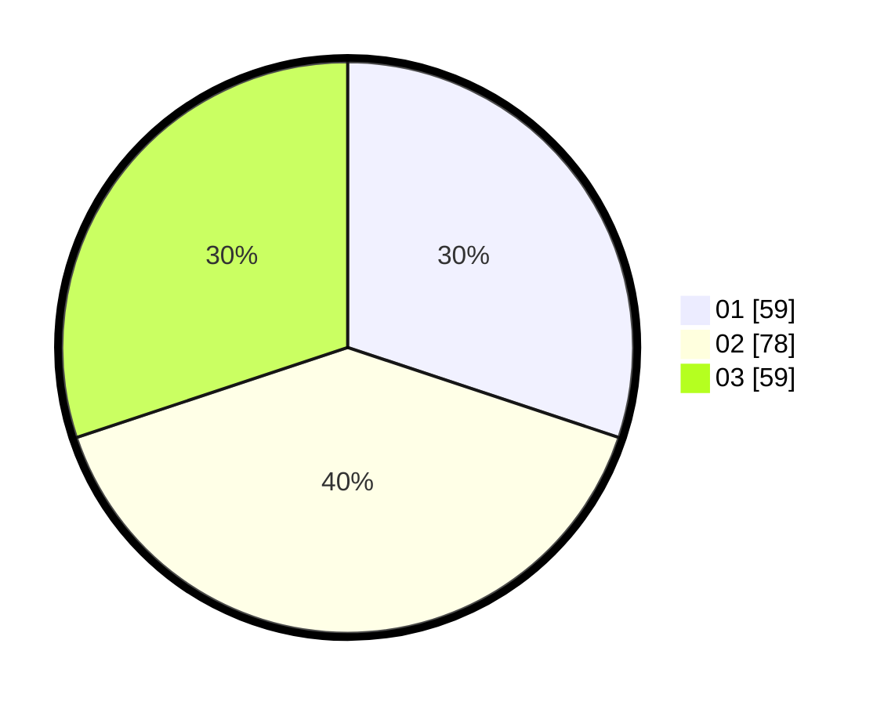

# Hasil

Hasil perolehan suara paslon dapat dilihat pada file paslon-01.txt, paslon-02.txt, dan paslon-03.txt.

Jika tidak ada, artinya data tersebut belum ada pada SIREKAP.

## Perolehan Suara

 * Paslon 01: **59**.
 * Paslon 02: **78**.
 * Paslon 03: **59**.

## Foto C Plano

https://sirekap-obj-formc.kpu.go.id/c530/pemilu/ppwp/31/74/05/10/04/3174051004126-20240214-155255--957b29ec-8346-4f17-b132-f1dadccadd2d.jpg

https://sirekap-obj-formc.kpu.go.id/c530/pemilu/ppwp/31/74/05/10/04/3174051004126-20240214-155320--34f8b0ed-deda-46fe-87f0-91bb9bcd2fe8.jpg

https://sirekap-obj-formc.kpu.go.id/c530/pemilu/ppwp/31/74/05/10/04/3174051004126-20240214-155337--2e36e952-8381-4395-a67d-8a3d1e4f48e1.jpg

## DATA PEMILIH TETAP

Jumlah pemilih dalam DPT: **256**.
 * L: **127**.
 * P: **129**.

## DATA PENGGUNA HAK PILIH

Jumlah pengguna hak pilih dalam DPT: **192**.
 * L: **95**.
 * P: **97**.

Jumlah pengguna hak pilih dalam DPTb: **10**.
 * L: **1**.
 * P: **9**.

Jumlah pengguna hak pilih dalam DPK: **0**.
 * L: **0**.
 * P: **0**.

Jumlah pengguna hak pilih: **202**.
 * L: **96**.
 * P: **106**.

## JUMLAH SUARA SAH DAN TIDAK SAH

JUMLAH SELURUH SUARA SAH: **196**.

JUMLAH SUARA TIDAK SAH: **6**.

JUMLAH SELURUH SUARA SAH DAN SUARA TIDAK SAH: **202**.
