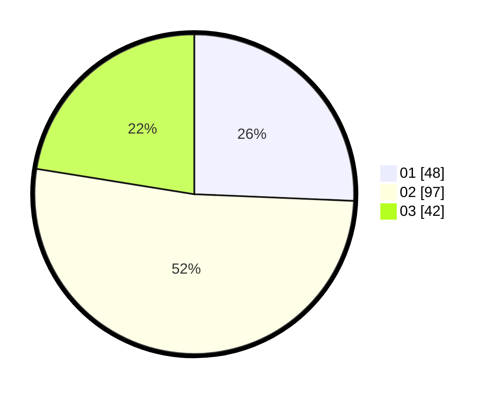

# Hasil

Hasil perolehan suara paslon dapat dilihat pada file paslon-01.txt, paslon-02.txt, dan paslon-03.txt.

Jika tidak ada, artinya data tersebut belum ada pada SIREKAP.

## Perolehan Suara

 * Paslon 01: **48**.
 * Paslon 02: **97**.
 * Paslon 03: **42**.

## Foto C Plano

https://sirekap-obj-formc.kpu.go.id/de82/pemilu/ppwp/31/74/05/10/04/3174051004131-20240214-201206--595f3338-f8e7-4832-a663-5a976eb6a2d4.jpg

https://sirekap-obj-formc.kpu.go.id/de82/pemilu/ppwp/31/74/05/10/04/3174051004131-20240214-201042--ef5926d8-514c-46f7-929c-8db216f01e32.jpg

https://sirekap-obj-formc.kpu.go.id/de82/pemilu/ppwp/31/74/05/10/04/3174051004131-20240214-214949--c0d36be2-299a-4c29-a50c-c2e14541f920.jpg

## DATA PEMILIH TETAP

Jumlah pemilih dalam DPT: **261**.
 * L: **138**.
 * P: **123**.

## DATA PENGGUNA HAK PILIH

Jumlah pengguna hak pilih dalam DPT: **183**.
 * L: **93**.
 * P: **90**.

Jumlah pengguna hak pilih dalam DPTb: **5**.
 * L: **1**.
 * P: **4**.

Jumlah pengguna hak pilih dalam DPK: **0**.
 * L: **0**.
 * P: **0**.

Jumlah pengguna hak pilih: **188**.
 * L: **94**.
 * P: **94**.

## JUMLAH SUARA SAH DAN TIDAK SAH

JUMLAH SELURUH SUARA SAH: **187**.

JUMLAH SUARA TIDAK SAH: **1**.

JUMLAH SELURUH SUARA SAH DAN SUARA TIDAK SAH: **188**.
