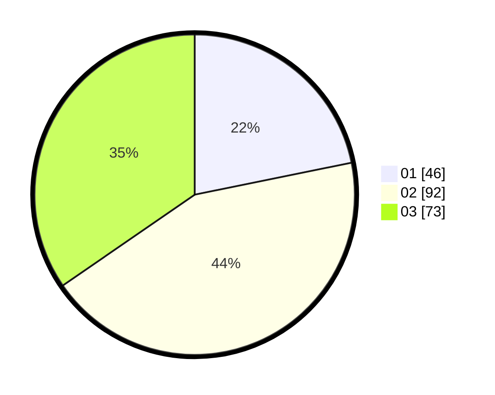

# Hasil

Hasil perolehan suara paslon dapat dilihat pada file paslon-01.txt, paslon-02.txt, dan paslon-03.txt.

Jika tidak ada, artinya data tersebut belum ada pada SIREKAP.

## Perolehan Suara

 * Paslon 01: **46**.
 * Paslon 02: **92**.
 * Paslon 03: **73**.

## Foto C Plano

https://sirekap-obj-formc.kpu.go.id/638a/pemilu/ppwp/31/74/05/10/04/3174051004135-20240216-135052--1ff14db9-2ef1-4cac-8695-3450e085735a.jpg

https://sirekap-obj-formc.kpu.go.id/638a/pemilu/ppwp/31/74/05/10/04/3174051004135-20240216-135053--cb58834f-e217-4d18-a3bd-a13e9933281f.jpg

https://sirekap-obj-formc.kpu.go.id/638a/pemilu/ppwp/31/74/05/10/04/3174051004135-20240216-135052--29c98f2a-82cc-425b-a566-496738085b01.jpg

## DATA PEMILIH TETAP

Jumlah pemilih dalam DPT: **214**.
 * L: **91**.
 * P: **123**.

## DATA PENGGUNA HAK PILIH

Jumlah pengguna hak pilih dalam DPT: **207**.
 * L: **90**.
 * P: **117**.

Jumlah pengguna hak pilih dalam DPTb: **7**.
 * L: **1**.
 * P: **6**.

Jumlah pengguna hak pilih dalam DPK: **5**.
 * L: **5**.
 * P: **0**.

Jumlah pengguna hak pilih: **219**.
 * L: **96**.
 * P: **123**.

## JUMLAH SUARA SAH DAN TIDAK SAH

JUMLAH SELURUH SUARA SAH: **211**.

JUMLAH SUARA TIDAK SAH: **3**.

JUMLAH SELURUH SUARA SAH DAN SUARA TIDAK SAH: **214**.
