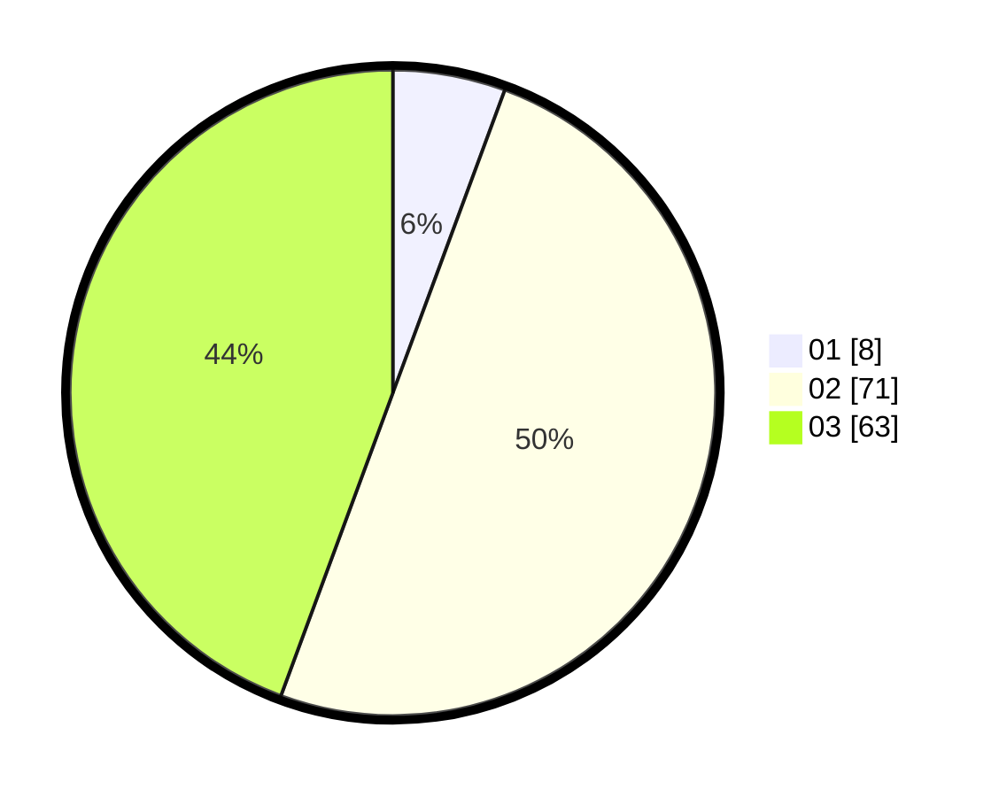

# Hasil

Hasil perolehan suara paslon dapat dilihat pada file paslon-01.txt, paslon-02.txt, dan paslon-03.txt.

Jika tidak ada, artinya data tersebut belum ada pada SIREKAP.

## Perolehan Suara

 * Paslon 01: **8**.
 * Paslon 02: **71**.
 * Paslon 03: **63**.

## Foto C Plano

https://sirekap-obj-formc.kpu.go.id/4eaf/pemilu/ppwp/31/74/05/10/04/3174051004136-20240215-125421--01746bf7-b265-4cd8-b63f-9b5009f459e0.jpg

https://sirekap-obj-formc.kpu.go.id/4eaf/pemilu/ppwp/31/74/05/10/04/3174051004136-20240215-125442--2aee2d3c-b561-45bc-8405-977126827f7b.jpg

https://sirekap-obj-formc.kpu.go.id/4eaf/pemilu/ppwp/31/74/05/10/04/3174051004136-20240215-125431--1e389d69-80d0-4e80-a5ae-1b882bc12762.jpg

## DATA PEMILIH TETAP

Jumlah pemilih dalam DPT: **197**.
 * L: **95**.
 * P: **102**.

## DATA PENGGUNA HAK PILIH

Jumlah pengguna hak pilih dalam DPT: **124**.
 * L: **65**.
 * P: **59**.

Jumlah pengguna hak pilih dalam DPTb: **9**.
 * L: **7**.
 * P: **2**.

Jumlah pengguna hak pilih dalam DPK: **10**.
 * L: **5**.
 * P: **5**.

Jumlah pengguna hak pilih: **143**.
 * L: **77**.
 * P: **66**.

## JUMLAH SUARA SAH DAN TIDAK SAH

JUMLAH SELURUH SUARA SAH: **142**.

JUMLAH SUARA TIDAK SAH: **1**.

JUMLAH SELURUH SUARA SAH DAN SUARA TIDAK SAH: **143**.
