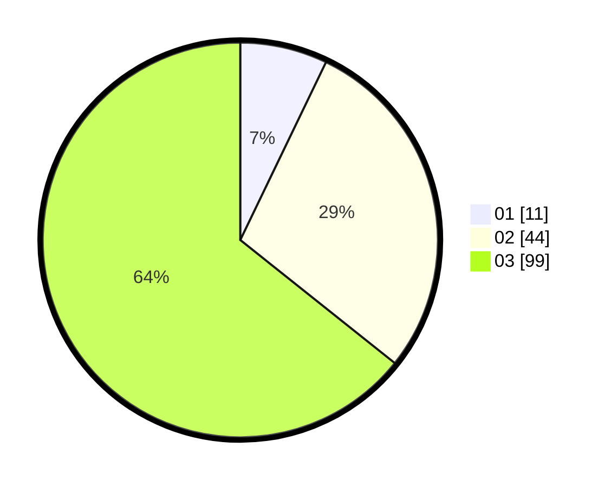

# Hasil

Hasil perolehan suara paslon dapat dilihat pada file paslon-01.txt, paslon-02.txt, dan paslon-03.txt.

Jika tidak ada, artinya data tersebut belum ada pada SIREKAP.

## Perolehan Suara

 * Paslon 01: **11**.
 * Paslon 02: **44**.
 * Paslon 03: **99**.

## Foto C Plano

https://sirekap-obj-formc.kpu.go.id/a6f6/pemilu/ppwp/31/74/05/10/04/3174051004137-20240215-234637--1c9a1911-e397-4e82-a749-dbbc83975db6.jpg

https://sirekap-obj-formc.kpu.go.id/a6f6/pemilu/ppwp/31/74/05/10/04/3174051004137-20240215-234641--8c99e16d-9e28-40f7-8834-aafa697c7d4e.jpg

https://sirekap-obj-formc.kpu.go.id/a6f6/pemilu/ppwp/31/74/05/10/04/3174051004137-20240215-234639--1d497cf7-87d0-4c88-b56c-76dbc574c9ad.jpg

## DATA PEMILIH TETAP

Jumlah pemilih dalam DPT: **179**.
 * L: **82**.
 * P: **97**.

## DATA PENGGUNA HAK PILIH

Jumlah pengguna hak pilih dalam DPT: **133**.
 * L: **65**.
 * P: **68**.

Jumlah pengguna hak pilih dalam DPTb: **14**.
 * L: **8**.
 * P: **6**.

Jumlah pengguna hak pilih dalam DPK: **8**.
 * L: **2**.
 * P: **6**.

Jumlah pengguna hak pilih: **155**.
 * L: **75**.
 * P: **80**.

## JUMLAH SUARA SAH DAN TIDAK SAH

JUMLAH SELURUH SUARA SAH: **154**.

JUMLAH SUARA TIDAK SAH: **1**.

JUMLAH SELURUH SUARA SAH DAN SUARA TIDAK SAH: **155**.
