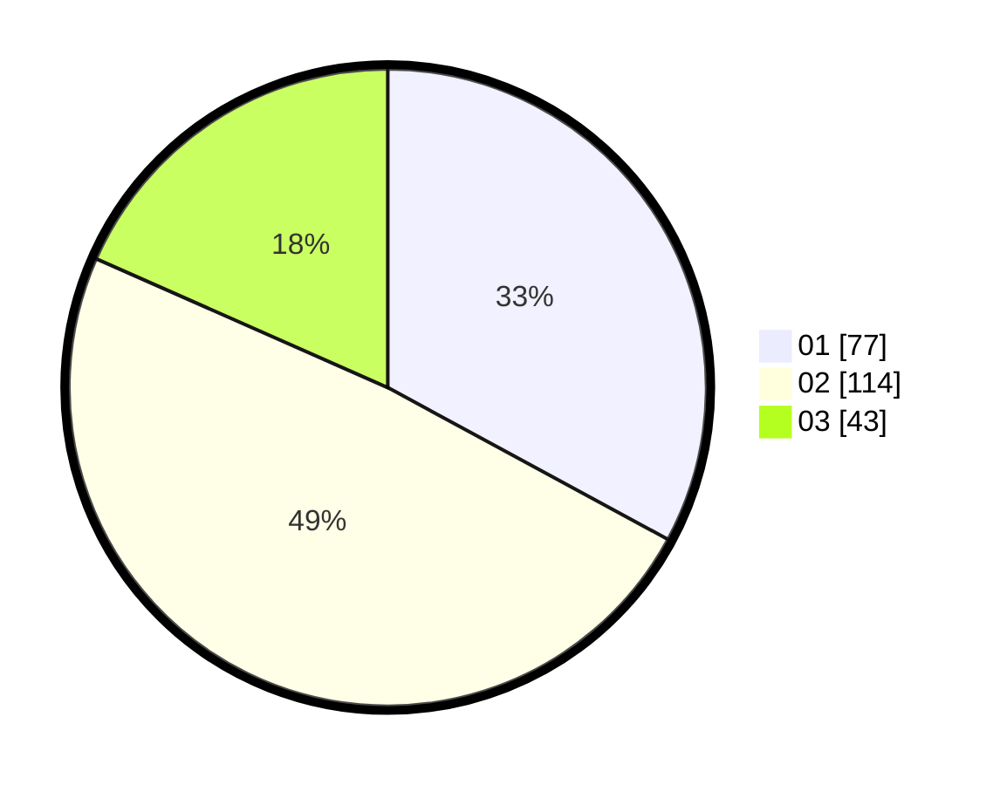

# Hasil

Hasil perolehan suara paslon dapat dilihat pada file paslon-01.txt, paslon-02.txt, dan paslon-03.txt.

Jika tidak ada, artinya data tersebut belum ada pada SIREKAP.

## Perolehan Suara

 * Paslon 01: **77**.
 * Paslon 02: **114**.
 * Paslon 03: **43**.

## Foto C Plano

https://sirekap-obj-formc.kpu.go.id/0125/pemilu/ppwp/31/74/05/10/05/3174051005001-20240217-100801--ede8dad9-cae4-45db-a74b-b3e5db883d23.jpg

https://sirekap-obj-formc.kpu.go.id/0125/pemilu/ppwp/31/74/05/10/05/3174051005001-20240217-100949--1f97cfd1-5aa3-4dbb-a522-1d5635fd91e0.jpg

https://sirekap-obj-formc.kpu.go.id/0125/pemilu/ppwp/31/74/05/10/05/3174051005001-20240217-101305--a24f0973-e591-41d0-9c2f-b4363f6a2611.jpg

## DATA PEMILIH TETAP

Jumlah pemilih dalam DPT: **289**.
 * L: **147**.
 * P: **142**.

## DATA PENGGUNA HAK PILIH

Jumlah pengguna hak pilih dalam DPT: **215**.
 * L: **96**.
 * P: **119**.

Jumlah pengguna hak pilih dalam DPTb: **18**.
 * L: **10**.
 * P: **8**.

Jumlah pengguna hak pilih dalam DPK: **4**.
 * L: **2**.
 * P: **2**.

Jumlah pengguna hak pilih: **237**.
 * L: **108**.
 * P: **129**.

## JUMLAH SUARA SAH DAN TIDAK SAH

JUMLAH SELURUH SUARA SAH: **234**.

JUMLAH SUARA TIDAK SAH: **3**.

JUMLAH SELURUH SUARA SAH DAN SUARA TIDAK SAH: **237**.
