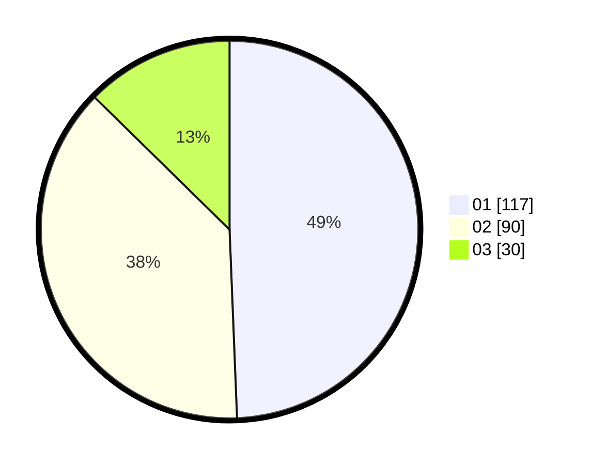

# Hasil

Hasil perolehan suara paslon dapat dilihat pada file paslon-01.txt, paslon-02.txt, dan paslon-03.txt.

Jika tidak ada, artinya data tersebut belum ada pada SIREKAP.

## Perolehan Suara

 * Paslon 01: **117**.
 * Paslon 02: **90**.
 * Paslon 03: **30**.

## Foto C Plano

https://sirekap-obj-formc.kpu.go.id/1a54/pemilu/ppwp/31/74/05/10/05/3174051005002-20240216-125744--1b163d85-2c26-4cd3-8422-777d3fab4a28.jpg

https://sirekap-obj-formc.kpu.go.id/1a54/pemilu/ppwp/31/74/05/10/05/3174051005002-20240216-100903--3f5c2e57-37dd-4411-aa53-2fd2b68b9d1f.jpg

https://sirekap-obj-formc.kpu.go.id/1a54/pemilu/ppwp/31/74/05/10/05/3174051005002-20240216-081120--9e6cc188-6381-4fb3-aa61-14b78de5409c.jpg

## DATA PEMILIH TETAP

Jumlah pemilih dalam DPT: **295**.
 * L: **146**.
 * P: **149**.

## DATA PENGGUNA HAK PILIH

Jumlah pengguna hak pilih dalam DPT: **224**.
 * L: **108**.
 * P: **116**.

Jumlah pengguna hak pilih dalam DPTb: **15**.
 * L: **5**.
 * P: **10**.

Jumlah pengguna hak pilih dalam DPK: **1**.
 * L: **1**.
 * P: **0**.

Jumlah pengguna hak pilih: **240**.
 * L: **114**.
 * P: **126**.

## JUMLAH SUARA SAH DAN TIDAK SAH

JUMLAH SELURUH SUARA SAH: **237**.

JUMLAH SUARA TIDAK SAH: **3**.

JUMLAH SELURUH SUARA SAH DAN SUARA TIDAK SAH: **240**.
