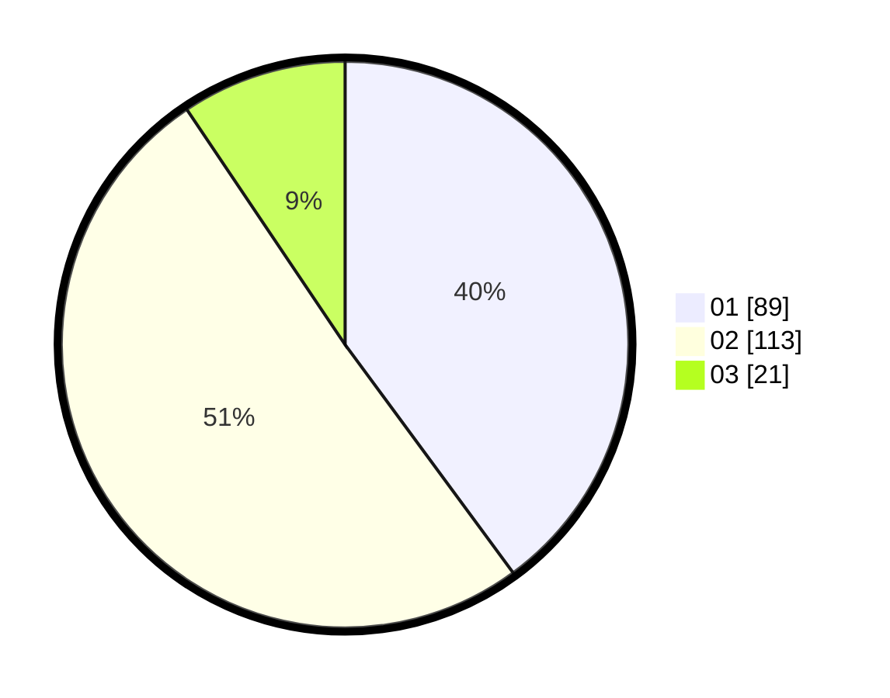

# Hasil

Hasil perolehan suara paslon dapat dilihat pada file paslon-01.txt, paslon-02.txt, dan paslon-03.txt.

Jika tidak ada, artinya data tersebut belum ada pada SIREKAP.

## Perolehan Suara

 * Paslon 01: **89**.
 * Paslon 02: **113**.
 * Paslon 03: **21**.

## Foto C Plano

https://sirekap-obj-formc.kpu.go.id/6c47/pemilu/ppwp/31/74/05/10/05/3174051005018-20240215-094411--c2dae832-13cd-4e54-8360-32535dd2fb01.jpg

https://sirekap-obj-formc.kpu.go.id/6c47/pemilu/ppwp/31/74/05/10/05/3174051005018-20240215-094417--f6ab690c-e3bb-4581-a7a4-ee588942ecbb.jpg

https://sirekap-obj-formc.kpu.go.id/6c47/pemilu/ppwp/31/74/05/10/05/3174051005018-20240215-094424--84353e23-f791-49db-b3eb-e5b4a81580b4.jpg
