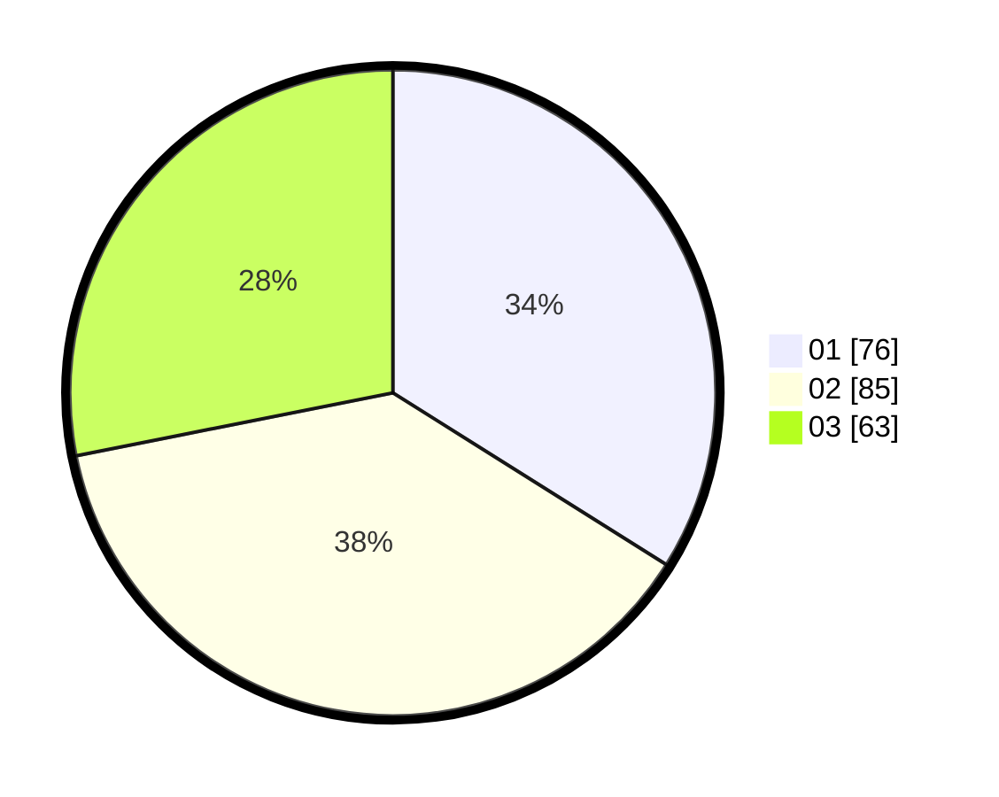

# Hasil

Hasil perolehan suara paslon dapat dilihat pada file paslon-01.txt, paslon-02.txt, dan paslon-03.txt.

Jika tidak ada, artinya data tersebut belum ada pada SIREKAP.

## Perolehan Suara

 * Paslon 01: **76**.
 * Paslon 02: **85**.
 * Paslon 03: **63**.

## Foto C Plano

https://sirekap-obj-formc.kpu.go.id/0421/pemilu/ppwp/31/74/05/10/05/3174051005021-20240214-184812--3c4a405b-a470-4c78-84f6-c93082de3b55.jpg

https://sirekap-obj-formc.kpu.go.id/0421/pemilu/ppwp/31/74/05/10/05/3174051005021-20240214-190602--5d8ac6ea-8e2e-4fe4-98b9-0288401f2183.jpg

https://sirekap-obj-formc.kpu.go.id/0421/pemilu/ppwp/31/74/05/10/05/3174051005021-20240214-190120--8abb8e44-5128-4cc4-857f-59255b81675f.jpg

## DATA PEMILIH TETAP

Jumlah pemilih dalam DPT: **279**.
 * L: **145**.
 * P: **134**.

## DATA PENGGUNA HAK PILIH

Jumlah pengguna hak pilih dalam DPT: **198**.
 * L: **103**.
 * P: **95**.

Jumlah pengguna hak pilih dalam DPTb: **21**.
 * L: **13**.
 * P: **8**.

Jumlah pengguna hak pilih dalam DPK: **9**.
 * L: **4**.
 * P: **5**.

Jumlah pengguna hak pilih: **228**.
 * L: **120**.
 * P: **108**.

## JUMLAH SUARA SAH DAN TIDAK SAH

JUMLAH SELURUH SUARA SAH: **224**.

JUMLAH SUARA TIDAK SAH: **4**.

JUMLAH SELURUH SUARA SAH DAN SUARA TIDAK SAH: **228**.
