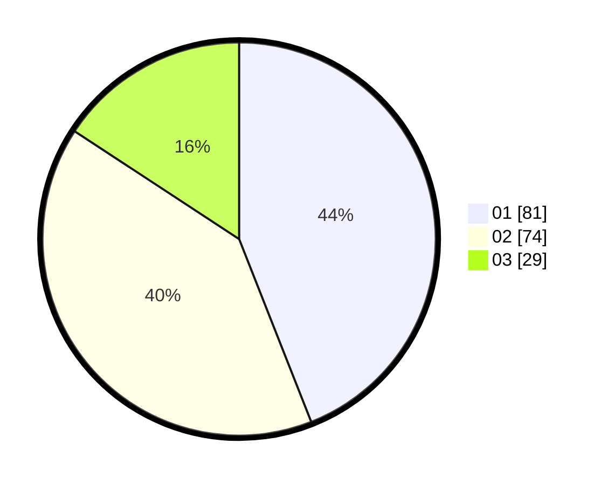

# Hasil

Hasil perolehan suara paslon dapat dilihat pada file paslon-01.txt, paslon-02.txt, dan paslon-03.txt.

Jika tidak ada, artinya data tersebut belum ada pada SIREKAP.

## Perolehan Suara

 * Paslon 01: **81**.
 * Paslon 02: **74**.
 * Paslon 03: **29**.

## Foto C Plano

https://sirekap-obj-formc.kpu.go.id/267c/pemilu/ppwp/31/74/05/10/05/3174051005022-20240214-222401--b2112781-0860-47ce-a7ef-dda833cd10ed.jpg

https://sirekap-obj-formc.kpu.go.id/267c/pemilu/ppwp/31/74/05/10/05/3174051005022-20240214-222634--91c2ded2-bb1a-49b0-ba3c-0f9f3a545123.jpg

https://sirekap-obj-formc.kpu.go.id/267c/pemilu/ppwp/31/74/05/10/05/3174051005022-20240214-222828--42e1b1b9-c5bd-4233-bfec-db1a98c3c5a1.jpg
