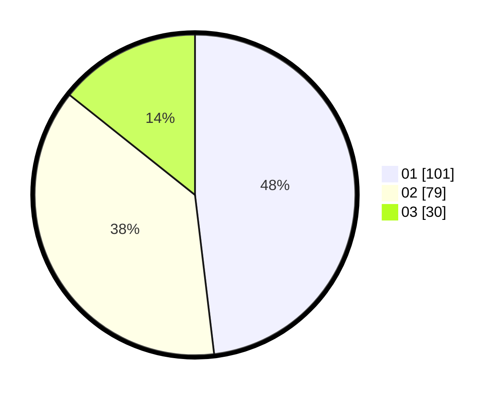

# Hasil

Hasil perolehan suara paslon dapat dilihat pada file paslon-01.txt, paslon-02.txt, dan paslon-03.txt.

Jika tidak ada, artinya data tersebut belum ada pada SIREKAP.

## Perolehan Suara

 * Paslon 01: **101**.
 * Paslon 02: **79**.
 * Paslon 03: **30**.

## Foto C Plano

https://sirekap-obj-formc.kpu.go.id/0baa/pemilu/ppwp/31/74/05/10/05/3174051005033-20240215-054822--5989e5e8-1d39-48a1-b77d-9691f13a1e23.jpg

https://sirekap-obj-formc.kpu.go.id/0baa/pemilu/ppwp/31/74/05/10/05/3174051005033-20240215-054844--dc0778d4-2c66-434a-922f-1152e3f7d0e3.jpg

https://sirekap-obj-formc.kpu.go.id/0baa/pemilu/ppwp/31/74/05/10/05/3174051005033-20240215-054832--1c212c04-03c7-4f74-85af-6d201cb9aad6.jpg

## DATA PEMILIH TETAP

Jumlah pemilih dalam DPT: **270**.
 * L: **144**.
 * P: **126**.

## DATA PENGGUNA HAK PILIH

Jumlah pengguna hak pilih dalam DPT: **213**.
 * L: **109**.
 * P: **104**.

Jumlah pengguna hak pilih dalam DPTb: **4**.
 * L: **3**.
 * P: **1**.

Jumlah pengguna hak pilih dalam DPK: **0**.
 * L: **0**.
 * P: **0**.

Jumlah pengguna hak pilih: **217**.
 * L: **112**.
 * P: **105**.

## JUMLAH SUARA SAH DAN TIDAK SAH

JUMLAH SELURUH SUARA SAH: **210**.

JUMLAH SUARA TIDAK SAH: **7**.

JUMLAH SELURUH SUARA SAH DAN SUARA TIDAK SAH: **217**.
