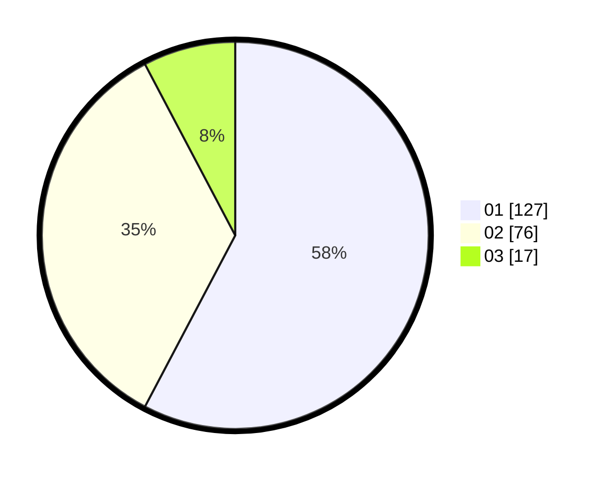

# Hasil

Hasil perolehan suara paslon dapat dilihat pada file paslon-01.txt, paslon-02.txt, dan paslon-03.txt.

Jika tidak ada, artinya data tersebut belum ada pada SIREKAP.

## Perolehan Suara

 * Paslon 01: **127**.
 * Paslon 02: **76**.
 * Paslon 03: **17**.

## Foto C Plano

https://sirekap-obj-formc.kpu.go.id/b28f/pemilu/ppwp/31/74/05/10/05/3174051005035-20240214-203543--c81c0d67-32e5-48d8-b0e9-81aff25248d7.jpg

https://sirekap-obj-formc.kpu.go.id/b28f/pemilu/ppwp/31/74/05/10/05/3174051005035-20240214-203657--3d1b77ec-93fc-42de-8ef4-7b66dc0473f6.jpg

https://sirekap-obj-formc.kpu.go.id/b28f/pemilu/ppwp/31/74/05/10/05/3174051005035-20240214-203803--c5cdccf5-db99-4e2a-bb29-d628a16646c3.jpg

## DATA PEMILIH TETAP

Jumlah pemilih dalam DPT: **261**.
 * L: **143**.
 * P: **118**.

## DATA PENGGUNA HAK PILIH

Jumlah pengguna hak pilih dalam DPT: **208**.
 * L: **112**.
 * P: **96**.

Jumlah pengguna hak pilih dalam DPTb: **11**.
 * L: **6**.
 * P: **5**.

Jumlah pengguna hak pilih dalam DPK: **3**.
 * L: **2**.
 * P: **1**.

Jumlah pengguna hak pilih: **222**.
 * L: **120**.
 * P: **102**.

## JUMLAH SUARA SAH DAN TIDAK SAH

JUMLAH SELURUH SUARA SAH: **220**.

JUMLAH SUARA TIDAK SAH: **2**.

JUMLAH SELURUH SUARA SAH DAN SUARA TIDAK SAH: **222**.
