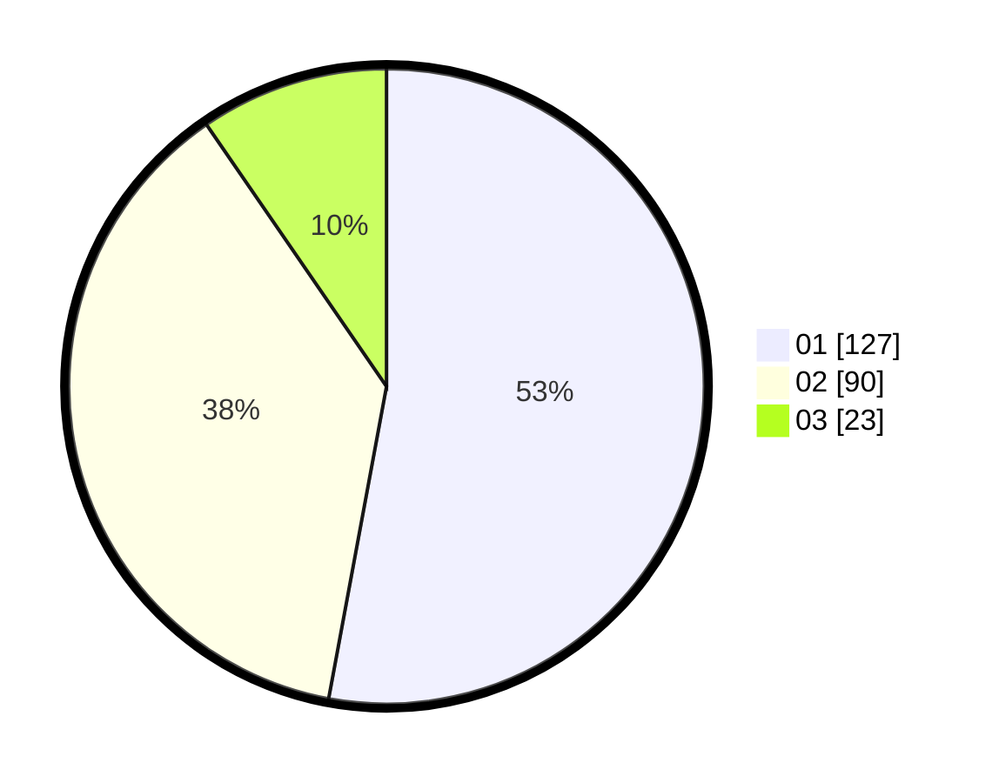

# Hasil

Hasil perolehan suara paslon dapat dilihat pada file paslon-01.txt, paslon-02.txt, dan paslon-03.txt.

Jika tidak ada, artinya data tersebut belum ada pada SIREKAP.

## Perolehan Suara

 * Paslon 01: **127**.
 * Paslon 02: **90**.
 * Paslon 03: **23**.

## Foto C Plano

https://sirekap-obj-formc.kpu.go.id/50ed/pemilu/ppwp/31/74/05/10/05/3174051005038-20240214-155250--d02e3422-96ba-41fc-af92-a86da4087c18.jpg

https://sirekap-obj-formc.kpu.go.id/50ed/pemilu/ppwp/31/74/05/10/05/3174051005038-20240214-155342--9951eb7d-7ddb-4086-8f94-ca13f30c7e15.jpg

https://sirekap-obj-formc.kpu.go.id/50ed/pemilu/ppwp/31/74/05/10/05/3174051005038-20240214-155430--949208ae-659a-4701-87ae-ffd5ac601a9b.jpg

## DATA PEMILIH TETAP

Jumlah pemilih dalam DPT: **284**.
 * L: **147**.
 * P: **137**.

## DATA PENGGUNA HAK PILIH

Jumlah pengguna hak pilih dalam DPT: **239**.
 * L: **121**.
 * P: **118**.

Jumlah pengguna hak pilih dalam DPTb: **3**.
 * L: **1**.
 * P: **2**.

Jumlah pengguna hak pilih dalam DPK: **0**.
 * L: **0**.
 * P: **0**.

Jumlah pengguna hak pilih: **242**.
 * L: **122**.
 * P: **120**.

## JUMLAH SUARA SAH DAN TIDAK SAH

JUMLAH SELURUH SUARA SAH: **240**.

JUMLAH SUARA TIDAK SAH: **2**.

JUMLAH SELURUH SUARA SAH DAN SUARA TIDAK SAH: **242**.
