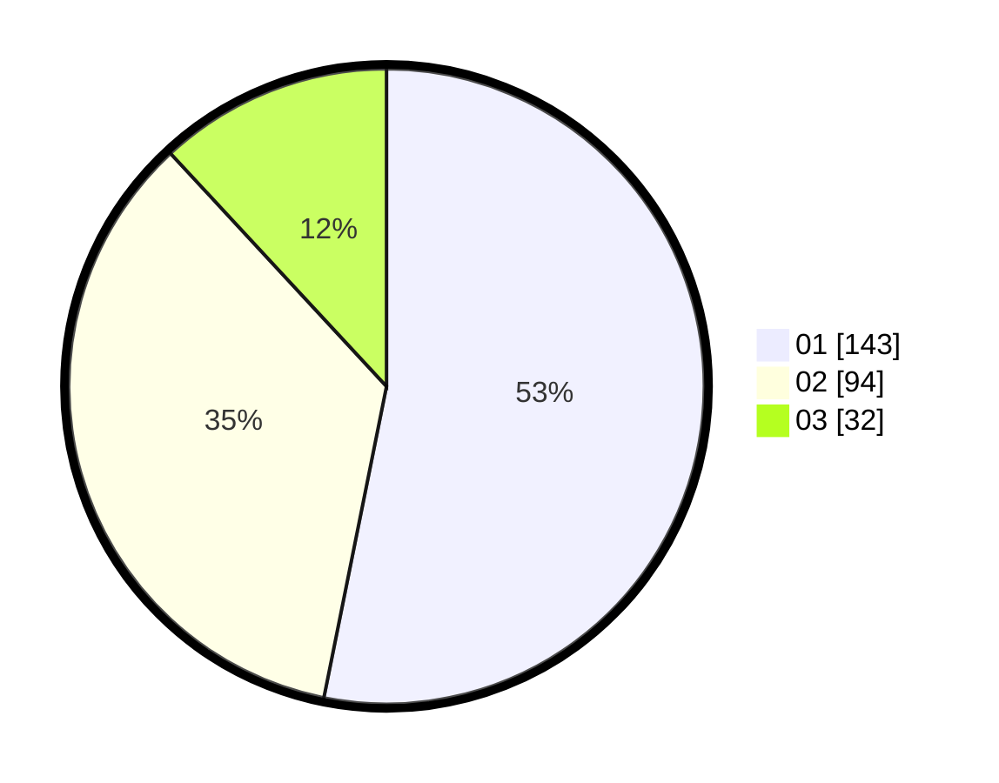

# Hasil

Hasil perolehan suara paslon dapat dilihat pada file paslon-01.txt, paslon-02.txt, dan paslon-03.txt.

Jika tidak ada, artinya data tersebut belum ada pada SIREKAP.

## Perolehan Suara

 * Paslon 01: **143**.
 * Paslon 02: **94**.
 * Paslon 03: **32**.

## Foto C Plano

https://sirekap-obj-formc.kpu.go.id/b68e/pemilu/ppwp/31/74/05/10/05/3174051005069-20240217-144406--e24639d2-feb8-4699-bc3e-c0a985cc7fba.jpg

https://sirekap-obj-formc.kpu.go.id/b68e/pemilu/ppwp/31/74/05/10/05/3174051005069-20240217-142559--d55560cf-0d9b-4dba-bc7b-b2b431a32b5e.jpg

https://sirekap-obj-formc.kpu.go.id/b68e/pemilu/ppwp/31/74/05/10/05/3174051005069-20240217-142746--cdb2d616-a911-49a6-b97e-7b0d2668bc8a.jpg

## DATA PEMILIH TETAP

Jumlah pemilih dalam DPT: **286**.
 * L: **142**.
 * P: **144**.

## DATA PENGGUNA HAK PILIH

Jumlah pengguna hak pilih dalam DPT: **251**.
 * L: **121**.
 * P: **130**.

Jumlah pengguna hak pilih dalam DPTb: **13**.
 * L: **6**.
 * P: **7**.

Jumlah pengguna hak pilih dalam DPK: **5**.
 * L: **3**.
 * P: **2**.

Jumlah pengguna hak pilih: **269**.
 * L: **130**.
 * P: **139**.

## JUMLAH SUARA SAH DAN TIDAK SAH

JUMLAH SELURUH SUARA SAH: **269**.

JUMLAH SUARA TIDAK SAH: **0**.

JUMLAH SELURUH SUARA SAH DAN SUARA TIDAK SAH: **269**.
