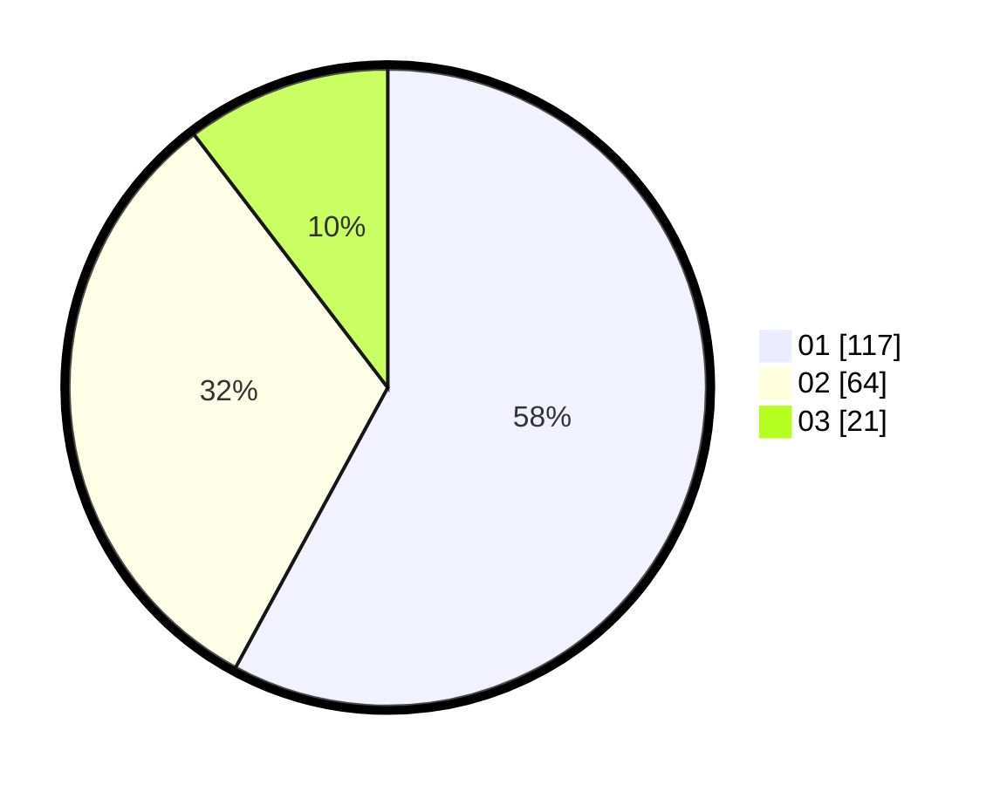

# Hasil

Hasil perolehan suara paslon dapat dilihat pada file paslon-01.txt, paslon-02.txt, dan paslon-03.txt.

Jika tidak ada, artinya data tersebut belum ada pada SIREKAP.

## Perolehan Suara

 * Paslon 01: **117**.
 * Paslon 02: **64**.
 * Paslon 03: **21**.

## Foto C Plano

https://sirekap-obj-formc.kpu.go.id/54de/pemilu/ppwp/31/74/05/10/05/3174051005086-20240215-191527--22710ec0-6bf0-43f7-b9f4-276e75142d9b.jpg

https://sirekap-obj-formc.kpu.go.id/54de/pemilu/ppwp/31/74/05/10/05/3174051005086-20240215-191553--c9c2a94a-804f-451e-8c09-67db8d6a930b.jpg

https://sirekap-obj-formc.kpu.go.id/54de/pemilu/ppwp/31/74/05/10/05/3174051005086-20240215-191539--a5852b6c-059c-4986-8312-f7d188f6de92.jpg

## DATA PEMILIH TETAP

Jumlah pemilih dalam DPT: **254**.
 * L: **134**.
 * P: **120**.

## DATA PENGGUNA HAK PILIH

Jumlah pengguna hak pilih dalam DPT: **194**.
 * L: **99**.
 * P: **95**.

Jumlah pengguna hak pilih dalam DPTb: **9**.
 * L: **8**.
 * P: **1**.

Jumlah pengguna hak pilih dalam DPK: **0**.
 * L: **0**.
 * P: **0**.

Jumlah pengguna hak pilih: **203**.
 * L: **107**.
 * P: **96**.

## JUMLAH SUARA SAH DAN TIDAK SAH

JUMLAH SELURUH SUARA SAH: **202**.

JUMLAH SUARA TIDAK SAH: **7**.

JUMLAH SELURUH SUARA SAH DAN SUARA TIDAK SAH: **209**.
