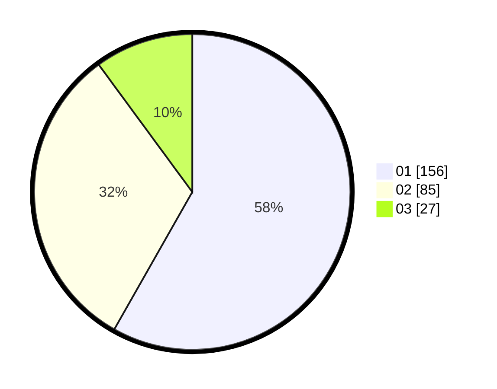

# Hasil

Hasil perolehan suara paslon dapat dilihat pada file paslon-01.txt, paslon-02.txt, dan paslon-03.txt.

Jika tidak ada, artinya data tersebut belum ada pada SIREKAP.

## Perolehan Suara

 * Paslon 01: **156**.
 * Paslon 02: **85**.
 * Paslon 03: **27**.

## Foto C Plano

https://sirekap-obj-formc.kpu.go.id/f3ea/pemilu/ppwp/31/74/05/10/05/3174051005090-20240215-034317--294364e0-c8c1-4f5f-a700-22e9ba964881.jpg

https://sirekap-obj-formc.kpu.go.id/f3ea/pemilu/ppwp/31/74/05/10/05/3174051005090-20240215-034338--1ec4088d-df7d-4daa-8b55-ed0307cf1250.jpg

https://sirekap-obj-formc.kpu.go.id/f3ea/pemilu/ppwp/31/74/05/10/05/3174051005090-20240215-034328--81c6cc32-43f1-4ae8-ba75-d1aa451982da.jpg

## DATA PEMILIH TETAP

Jumlah pemilih dalam DPT: **274**.
 * L: **145**.
 * P: **129**.

## DATA PENGGUNA HAK PILIH

Jumlah pengguna hak pilih dalam DPT: **240**.
 * L: **125**.
 * P: **115**.

Jumlah pengguna hak pilih dalam DPTb: **22**.
 * L: **11**.
 * P: **11**.

Jumlah pengguna hak pilih dalam DPK: **7**.
 * L: **2**.
 * P: **5**.

Jumlah pengguna hak pilih: **269**.
 * L: **138**.
 * P: **131**.

## JUMLAH SUARA SAH DAN TIDAK SAH

JUMLAH SELURUH SUARA SAH: **268**.

JUMLAH SUARA TIDAK SAH: **1**.

JUMLAH SELURUH SUARA SAH DAN SUARA TIDAK SAH: **269**.
