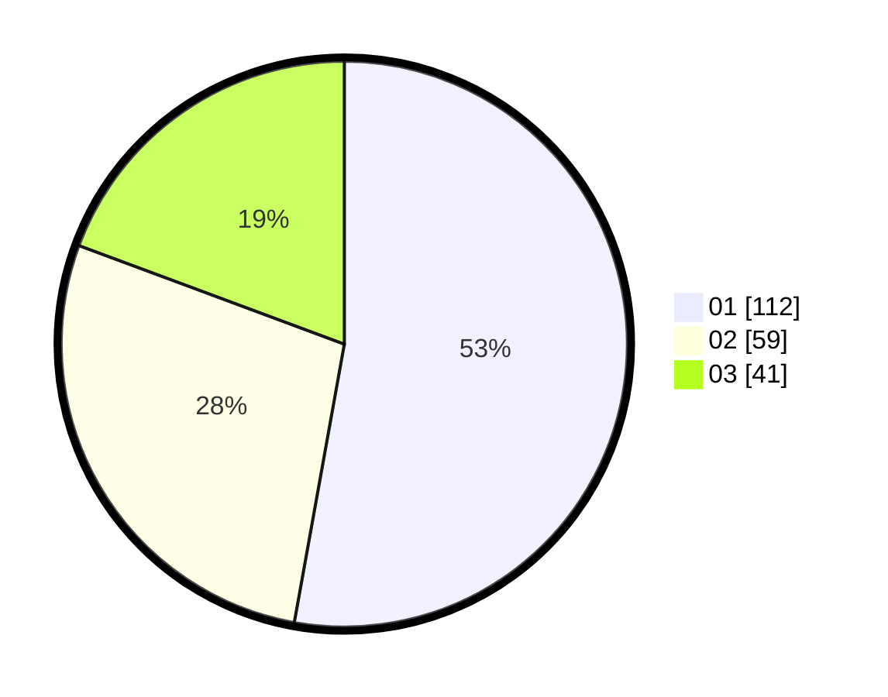

# Hasil

Hasil perolehan suara paslon dapat dilihat pada file paslon-01.txt, paslon-02.txt, dan paslon-03.txt.

Jika tidak ada, artinya data tersebut belum ada pada SIREKAP.

## Perolehan Suara

 * Paslon 01: **112**.
 * Paslon 02: **59**.
 * Paslon 03: **41**.

## Foto C Plano

https://sirekap-obj-formc.kpu.go.id/c952/pemilu/ppwp/31/74/05/10/05/3174051005100-20240216-083219--5908bf55-d9db-4ffa-ae23-528a2ffc8be3.jpg

https://sirekap-obj-formc.kpu.go.id/c952/pemilu/ppwp/31/74/05/10/05/3174051005100-20240216-083221--ae4848e6-a45a-4a8a-8c16-73209d127d09.jpg

https://sirekap-obj-formc.kpu.go.id/c952/pemilu/ppwp/31/74/05/10/05/3174051005100-20240216-083220--ef483e0f-f599-4363-aea8-96679a483392.jpg

## DATA PEMILIH TETAP

Jumlah pemilih dalam DPT: **250**.
 * L: **127**.
 * P: **123**.

## DATA PENGGUNA HAK PILIH

Jumlah pengguna hak pilih dalam DPT: **211**.
 * L: **111**.
 * P: **100**.

Jumlah pengguna hak pilih dalam DPTb: **5**.
 * L: **5**.
 * P: **0**.

Jumlah pengguna hak pilih dalam DPK: **1**.
 * L: **0**.
 * P: **1**.

Jumlah pengguna hak pilih: **217**.
 * L: **116**.
 * P: **101**.

## JUMLAH SUARA SAH DAN TIDAK SAH

JUMLAH SELURUH SUARA SAH: **212**.

JUMLAH SUARA TIDAK SAH: **5**.

JUMLAH SELURUH SUARA SAH DAN SUARA TIDAK SAH: **217**.
