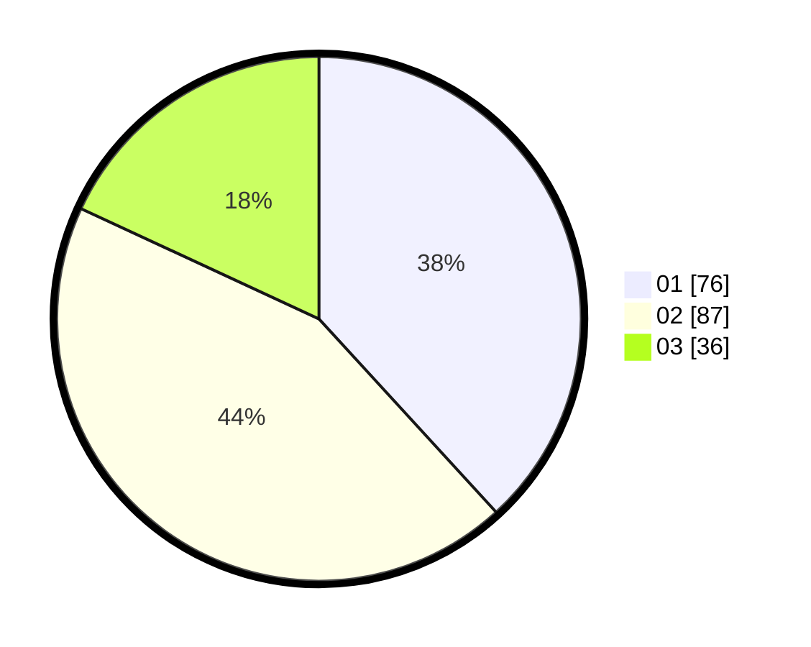

# Hasil

Hasil perolehan suara paslon dapat dilihat pada file paslon-01.txt, paslon-02.txt, dan paslon-03.txt.

Jika tidak ada, artinya data tersebut belum ada pada SIREKAP.

## Perolehan Suara

 * Paslon 01: **76**.
 * Paslon 02: **87**.
 * Paslon 03: **36**.

## Foto C Plano

https://sirekap-obj-formc.kpu.go.id/f4df/pemilu/ppwp/31/74/05/10/05/3174051005105-20240214-193851--18414825-cf2f-4dd0-9e4d-6a965db2a5f4.jpg

https://sirekap-obj-formc.kpu.go.id/f4df/pemilu/ppwp/31/74/05/10/05/3174051005105-20240214-233307--29f98ea0-a0b6-4303-8dbf-fa9ac039ac2e.jpg

https://sirekap-obj-formc.kpu.go.id/f4df/pemilu/ppwp/31/74/05/10/05/3174051005105-20240214-193855--e4024d9c-9940-422b-b2af-9cafc6119d74.jpg

## DATA PEMILIH TETAP

Jumlah pemilih dalam DPT: **239**.
 * L: **114**.
 * P: **125**.

## DATA PENGGUNA HAK PILIH

Jumlah pengguna hak pilih dalam DPT: **200**.
 * L: **95**.
 * P: **105**.

Jumlah pengguna hak pilih dalam DPTb: **1**.
 * L: **0**.
 * P: **1**.

Jumlah pengguna hak pilih dalam DPK: **3**.
 * L: **1**.
 * P: **2**.

Jumlah pengguna hak pilih: **204**.
 * L: **96**.
 * P: **108**.

## JUMLAH SUARA SAH DAN TIDAK SAH

JUMLAH SELURUH SUARA SAH: **199**.

JUMLAH SUARA TIDAK SAH: **5**.

JUMLAH SELURUH SUARA SAH DAN SUARA TIDAK SAH: **204**.
