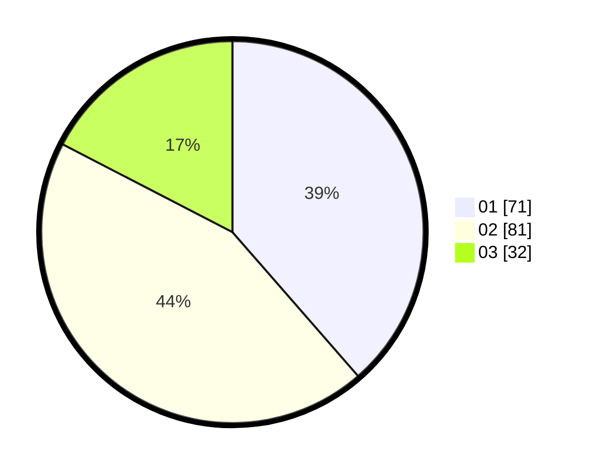

# Hasil

Hasil perolehan suara paslon dapat dilihat pada file paslon-01.txt, paslon-02.txt, dan paslon-03.txt.

Jika tidak ada, artinya data tersebut belum ada pada SIREKAP.

## Perolehan Suara

 * Paslon 01: **71**.
 * Paslon 02: **81**.
 * Paslon 03: **32**.

## Foto C Plano

https://sirekap-obj-formc.kpu.go.id/65a9/pemilu/ppwp/31/74/05/10/05/3174051005106-20240216-175258--c94f1895-5741-4ec6-8bd3-6bb5e00142b4.jpg

https://sirekap-obj-formc.kpu.go.id/65a9/pemilu/ppwp/31/74/05/10/05/3174051005106-20240216-175300--ff296a1f-cdc4-49ec-87c4-9ed82dbd637d.jpg

https://sirekap-obj-formc.kpu.go.id/65a9/pemilu/ppwp/31/74/05/10/05/3174051005106-20240216-175259--b497ed5b-2c37-4985-baa3-0a90ac83d535.jpg

## DATA PEMILIH TETAP

Jumlah pemilih dalam DPT: **251**.
 * L: **123**.
 * P: **126**.

## DATA PENGGUNA HAK PILIH

Jumlah pengguna hak pilih dalam DPT: **184**.
 * L: **84**.
 * P: **100**.

Jumlah pengguna hak pilih dalam DPTb: **0**.
 * L: **0**.
 * P: **0**.

Jumlah pengguna hak pilih dalam DPK: **3**.
 * L: **1**.
 * P: **2**.

Jumlah pengguna hak pilih: **187**.
 * L: **85**.
 * P: **102**.

## JUMLAH SUARA SAH DAN TIDAK SAH

JUMLAH SELURUH SUARA SAH: **184**.

JUMLAH SUARA TIDAK SAH: **3**.

JUMLAH SELURUH SUARA SAH DAN SUARA TIDAK SAH: **187**.
