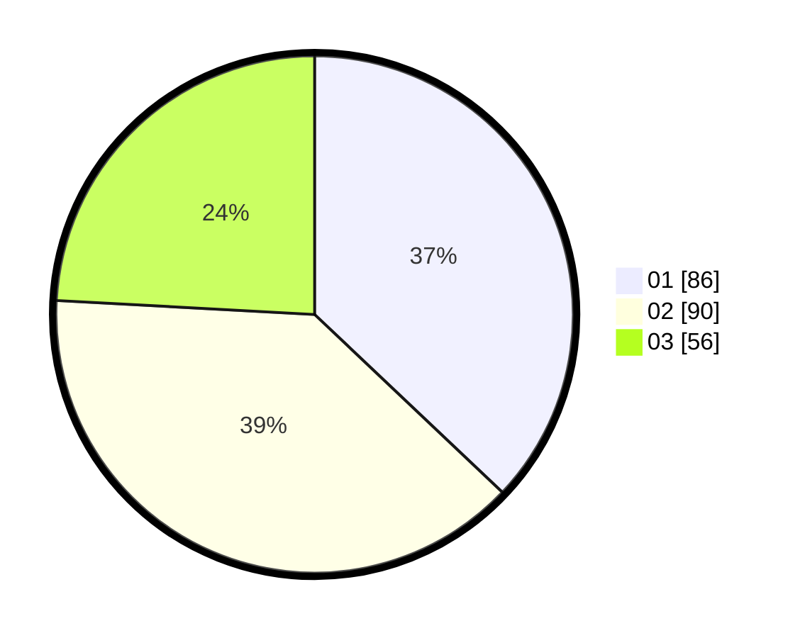

# Hasil

Hasil perolehan suara paslon dapat dilihat pada file paslon-01.txt, paslon-02.txt, dan paslon-03.txt.

Jika tidak ada, artinya data tersebut belum ada pada SIREKAP.

## Perolehan Suara

 * Paslon 01: **86**.
 * Paslon 02: **90**.
 * Paslon 03: **56**.

## Foto C Plano

https://sirekap-obj-formc.kpu.go.id/422d/pemilu/ppwp/31/74/05/10/05/3174051005110-20240216-093824--9d15dbe8-5a40-4941-8e87-d31e659e5581.jpg

https://sirekap-obj-formc.kpu.go.id/422d/pemilu/ppwp/31/74/05/10/05/3174051005110-20240216-080332--aa7288f1-c481-427c-b838-a65c39a7094e.jpg

https://sirekap-obj-formc.kpu.go.id/422d/pemilu/ppwp/31/74/05/10/05/3174051005110-20240216-080330--c5ce59d5-73d9-4f3b-a413-f54b68457704.jpg

## DATA PEMILIH TETAP

Jumlah pemilih dalam DPT: **268**.
 * L: **120**.
 * P: **148**.

## DATA PENGGUNA HAK PILIH

Jumlah pengguna hak pilih dalam DPT: **228**.
 * L: **101**.
 * P: **127**.

Jumlah pengguna hak pilih dalam DPTb: **5**.
 * L: **4**.
 * P: **1**.

Jumlah pengguna hak pilih dalam DPK: **2**.
 * L: **0**.
 * P: **2**.

Jumlah pengguna hak pilih: **235**.
 * L: **105**.
 * P: **130**.

## JUMLAH SUARA SAH DAN TIDAK SAH

JUMLAH SELURUH SUARA SAH: **232**.

JUMLAH SUARA TIDAK SAH: **3**.

JUMLAH SELURUH SUARA SAH DAN SUARA TIDAK SAH: **235**.
