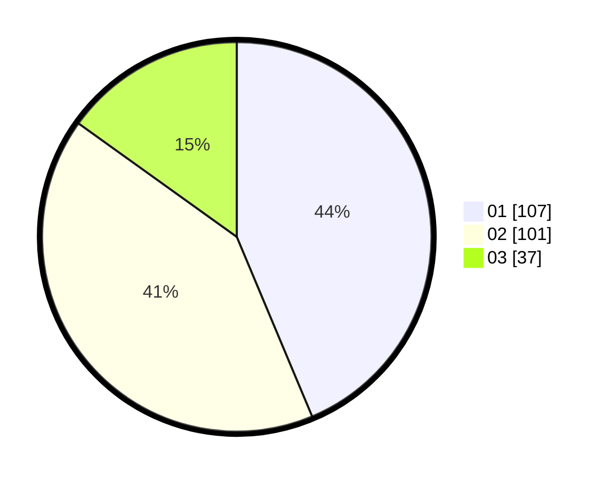

# Hasil

Hasil perolehan suara paslon dapat dilihat pada file paslon-01.txt, paslon-02.txt, dan paslon-03.txt.

Jika tidak ada, artinya data tersebut belum ada pada SIREKAP.

## Perolehan Suara

 * Paslon 01: **107**.
 * Paslon 02: **101**.
 * Paslon 03: **37**.

## Foto C Plano

https://sirekap-obj-formc.kpu.go.id/d222/pemilu/ppwp/31/74/05/10/05/3174051005120-20240214-221126--105aa00f-e7f7-4a7f-8efb-a76d762734ae.jpg

https://sirekap-obj-formc.kpu.go.id/d222/pemilu/ppwp/31/74/05/10/05/3174051005120-20240214-190114--ae409493-f0ee-4c5b-a1be-b27f53b3fdf3.jpg

https://sirekap-obj-formc.kpu.go.id/d222/pemilu/ppwp/31/74/05/10/05/3174051005120-20240214-190136--9c6f56f7-f5ad-464a-9c80-14ef2332c1f7.jpg

## DATA PEMILIH TETAP

Jumlah pemilih dalam DPT: **290**.
 * L: **142**.
 * P: **148**.

## DATA PENGGUNA HAK PILIH

Jumlah pengguna hak pilih dalam DPT: **246**.
 * L: **118**.
 * P: **128**.

Jumlah pengguna hak pilih dalam DPTb: **1**.
 * L: **0**.
 * P: **1**.

Jumlah pengguna hak pilih dalam DPK: **0**.
 * L: **0**.
 * P: **0**.

Jumlah pengguna hak pilih: **247**.
 * L: **118**.
 * P: **129**.

## JUMLAH SUARA SAH DAN TIDAK SAH

JUMLAH SELURUH SUARA SAH: **245**.

JUMLAH SUARA TIDAK SAH: **2**.

JUMLAH SELURUH SUARA SAH DAN SUARA TIDAK SAH: **247**.
