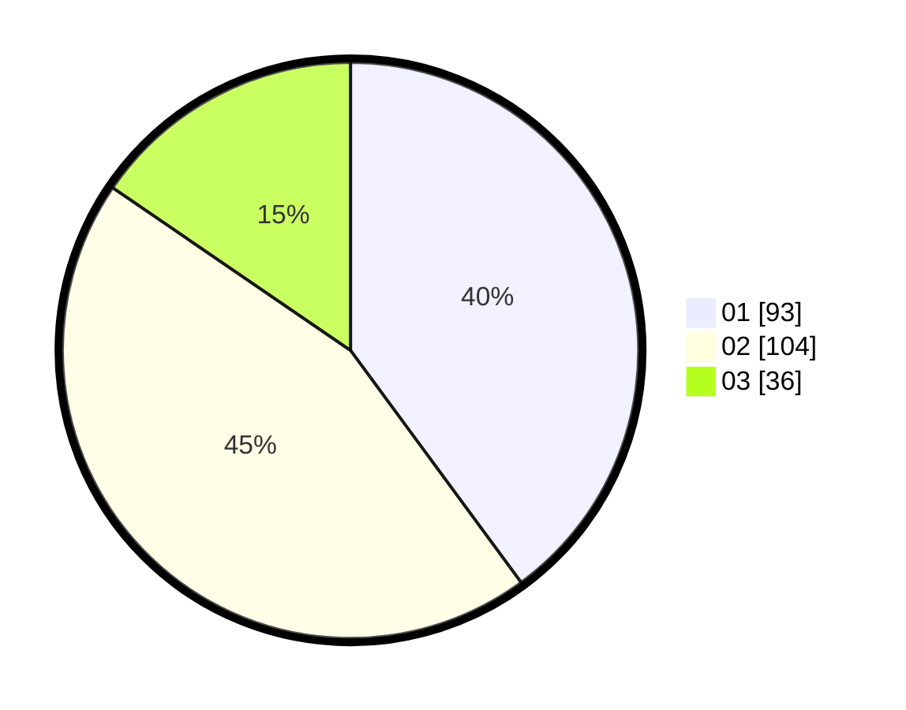

# Hasil

Hasil perolehan suara paslon dapat dilihat pada file paslon-01.txt, paslon-02.txt, dan paslon-03.txt.

Jika tidak ada, artinya data tersebut belum ada pada SIREKAP.

## Perolehan Suara

 * Paslon 01: **93**.
 * Paslon 02: **104**.
 * Paslon 03: **36**.

## Foto C Plano

https://sirekap-obj-formc.kpu.go.id/2803/pemilu/ppwp/31/74/05/10/05/3174051005123-20240216-154533--9cb7f9b1-bb7e-4333-8347-ed366cf19429.jpg

https://sirekap-obj-formc.kpu.go.id/2803/pemilu/ppwp/31/74/05/10/05/3174051005123-20240216-154550--ee32b311-42db-4c58-89fb-c102ea0c2d03.jpg

https://sirekap-obj-formc.kpu.go.id/2803/pemilu/ppwp/31/74/05/10/05/3174051005123-20240216-154603--e88f7418-6a33-4e35-8d96-68e349b1fb63.jpg

## DATA PEMILIH TETAP

Jumlah pemilih dalam DPT: **278**.
 * L: **139**.
 * P: **139**.

## DATA PENGGUNA HAK PILIH

Jumlah pengguna hak pilih dalam DPT: **234**.
 * L: **112**.
 * P: **122**.

Jumlah pengguna hak pilih dalam DPTb: **0**.
 * L: **0**.
 * P: **0**.

Jumlah pengguna hak pilih dalam DPK: **2**.
 * L: **0**.
 * P: **2**.

Jumlah pengguna hak pilih: **236**.
 * L: **112**.
 * P: **124**.

## JUMLAH SUARA SAH DAN TIDAK SAH

JUMLAH SELURUH SUARA SAH: **233**.

JUMLAH SUARA TIDAK SAH: **3**.

JUMLAH SELURUH SUARA SAH DAN SUARA TIDAK SAH: **236**.
