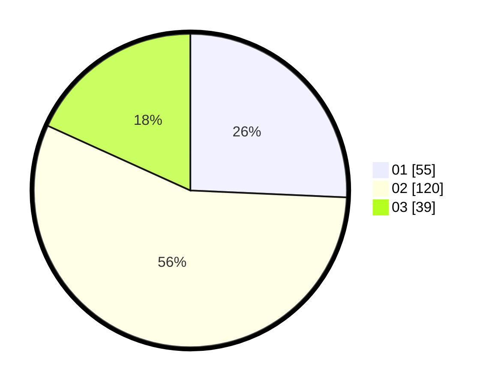

# Hasil

Hasil perolehan suara paslon dapat dilihat pada file paslon-01.txt, paslon-02.txt, dan paslon-03.txt.

Jika tidak ada, artinya data tersebut belum ada pada SIREKAP.

## Perolehan Suara

 * Paslon 01: **55**.
 * Paslon 02: **120**.
 * Paslon 03: **39**.

## Foto C Plano

https://sirekap-obj-formc.kpu.go.id/af36/pemilu/ppwp/31/74/05/10/05/3174051005138-20240216-001756--b380e815-5190-4a15-ae58-f96f324d786c.jpg

https://sirekap-obj-formc.kpu.go.id/af36/pemilu/ppwp/31/74/05/10/05/3174051005138-20240216-001822--ba06597e-8e51-492d-89bd-bb75745acdb7.jpg

https://sirekap-obj-formc.kpu.go.id/af36/pemilu/ppwp/31/74/05/10/05/3174051005138-20240216-001850--933aed5d-378c-412e-af35-2bbf20cdf8dc.jpg
