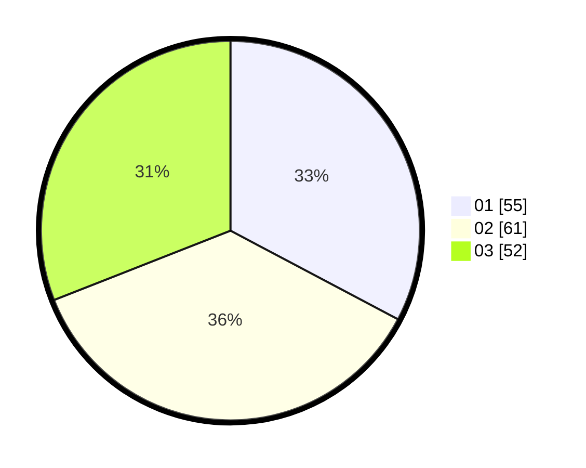

# Hasil

Hasil perolehan suara paslon dapat dilihat pada file paslon-01.txt, paslon-02.txt, dan paslon-03.txt.

Jika tidak ada, artinya data tersebut belum ada pada SIREKAP.

## Perolehan Suara

 * Paslon 01: **55**.
 * Paslon 02: **61**.
 * Paslon 03: **52**.

## Foto C Plano

https://sirekap-obj-formc.kpu.go.id/2f99/pemilu/ppwp/31/74/05/10/05/3174051005140-20240216-010331--e73f2171-06b6-4444-9441-6d6ef47e013b.jpg

https://sirekap-obj-formc.kpu.go.id/2f99/pemilu/ppwp/31/74/05/10/05/3174051005140-20240216-010332--d3cd6859-038f-43df-9324-534fcb3e02c3.jpg

https://sirekap-obj-formc.kpu.go.id/2f99/pemilu/ppwp/31/74/05/10/05/3174051005140-20240216-010331--ec2de873-8b09-4e8d-b397-ccc3d7e8e09b.jpg

## DATA PEMILIH TETAP

Jumlah pemilih dalam DPT: **217**.
 * L: **103**.
 * P: **114**.

## DATA PENGGUNA HAK PILIH

Jumlah pengguna hak pilih dalam DPT: **171**.
 * L: **82**.
 * P: **89**.

Jumlah pengguna hak pilih dalam DPTb: **0**.
 * L: **0**.
 * P: **0**.

Jumlah pengguna hak pilih dalam DPK: **3**.
 * L: **2**.
 * P: **1**.

Jumlah pengguna hak pilih: **174**.
 * L: **84**.
 * P: **90**.

## JUMLAH SUARA SAH DAN TIDAK SAH

JUMLAH SELURUH SUARA SAH: **168**.

JUMLAH SUARA TIDAK SAH: **6**.

JUMLAH SELURUH SUARA SAH DAN SUARA TIDAK SAH: **174**.
